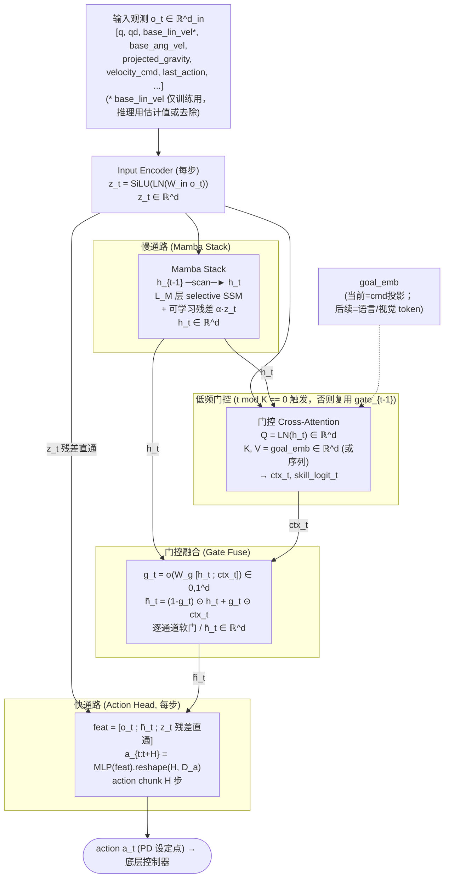
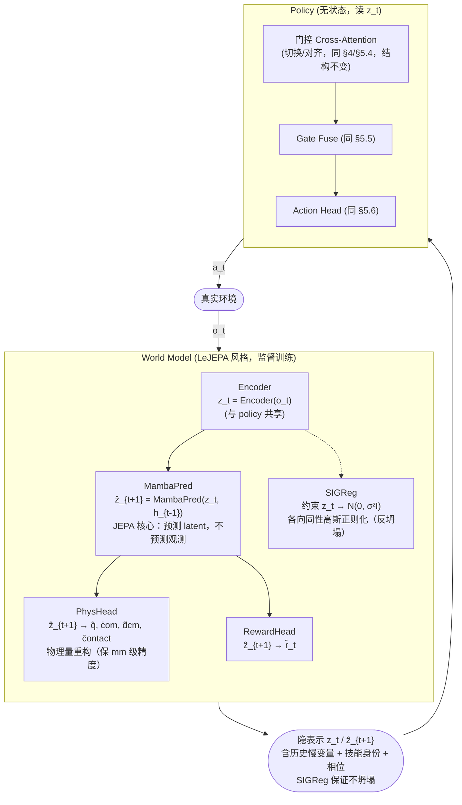
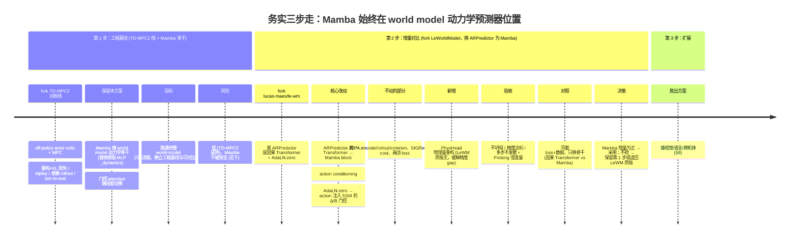

# 轻量 Transformer+Mamba 混合通用运控模型架构设计（v4 · LeJEPA 世界模型）

> 编写时间：2026年6月
>
> 版本：v4（在 v3 World-Model 路线基础上，**world model 正则化从 TD-MPC2 风格改为 LeJEPA（SIGReg）风格为主**、TD-MPC2 降为备选；精度采用 LeJEPA + 物理量重构联合训练。**实现顺序按 §7.4.1 务实三步走：先借 TD-MPC2 训练栈 + Mamba 骨干跑通工程基线，再换 LeJEPA 风格对比增量**——两步 Mamba 都在 world model 骨干位置，不被架空）
>
> 关联文档：[运控基础模型与通用运控模型研究](./运控基础模型与通用运控模型研究.md)
>
> 关联文档：[人形机器人RL控制架构-动力学融合与接触力处理](./人形机器人RL控制架构-动力学融合与接触力处理.md)
>
> 关联文档：[FlashSAC算法调研-相对PPO的优劣与流行度分析](./FlashSAC算法调研-相对PPO的优劣与流行度分析.md)
>
> 关联文档（世界模型选型依据）：[../世界模型/JEPA世界模型用于足式运动控制_空白分析与方案设计](../世界模型/JEPA世界模型用于足式运动控制_空白分析与方案设计.md)（LeJEPA-Loco 方案）
>
> 关联文档（LeJEPA 原文与生态）：../世界模型/ 下 LeJEPA_翻译v2.md、基于LeJEPA的研究生态全景报告.md、LeJEPA_第4章SIGReg梳理.md

---

## 目录

- [一、设计目标、约束与范围界定](#一设计目标约束与范围界定)
- [二、理论基础：为什么这个混合是合理的](#二理论基础为什么这个混合是合理的)
- [三、核心设计思想与职责划分](#三核心设计思想与职责划分)
- [四、整体架构与数据流](#四整体架构与数据流)
- [五、模块级规格（张量、参数、FLOPs）](#五模块级规格张量参数flops)
- [六、关键设计决策的取舍论证](#六关键设计决策的取舍论证)
- [七、训练范式：World-Model 路线（主）与直接 Policy 路线（备）](#七训练范式world-model-路线主与直接-policy-路线备)
- [八、推理与部署特性](#八推理与部署特性)
- [九、后续扩展路径与接口预留](#九后续扩展路径与接口预留)
- [十、与同类方案对比](#十与同类方案对比)
- [十一、Mamba-RL 已知不稳定性与对策](#十一mamba-rl-已知不稳定性与对策)
- [十二、关键判断、风险与适用边界](#十二关键判断风险与适用边界)
- [十三、最小可行实现路线](#十三最小可行实现路线)
- [附录 A：符号表](#附录-a符号表)
- [附录 B：参考事实与依据](#附录-b参考事实与依据)
  - [附录 B-2：源码核实记录（2026-06-19）](#附录-b-2源码核实记录2026-06-19clone-官方仓库亲读)
  - [附录 B-3：实测经验对照（UniLab Mamba 多技能人形运控）](#附录-b-3实测经验对照2026-06-19unilab-mamba-多技能人形运控)

---

## 一、设计目标、约束与范围界定

### 1.1 设计目标

设计一个**通用运控 policy 骨干**（Generalist Locomotion/Manipulation Policy Backbone），满足四项硬指标：

1. **多技能 + 平滑过渡**：单策略覆盖行走/跑步/跳跃/侧移/抗扰/多地形，技能间过渡无抖动、无卡顿、无跳回。
2. **轻量**：总参数 **0.6M~2.5M**（标准档 ~1.2M），对标当前人形运控主流 MLP 策略（0.3~1M）与小 Transformer 策略（3~8M）之间。
3. **长时序记忆**：显式建模"技能身份 + 阶段进度 + 动力学模式"等慢变量，突破纯 MLP 固定观测窗口的信息边界。
4. **可扩展**：当前以本体感觉（proprioception）为主、不含视觉；架构预留视觉 token、语言指令、跨机体 embedding 的接入点，且**接入不改主干**。

### 1.2 硬约束

| 约束 | 指标 | 设计含义 |
|---|---|---|
| 控制频率 | 50Hz~1kHz | 单步前向延迟须 <1ms（含状态更新） |
| 推理内存 | **恒定**，不随历史增长 | 放弃 Transformer KV-cache，采用状态压缩 |
| 训练栈 | 兼容 Isaac Lab；主路线为 World-Model（LeJEPA/SIGReg 风格），policy 无状态可接 off-policy | 有状态需求收敛到 world model 内（自监督+监督，无 off-policy 冲突） |
| 部署 | 机载 GPU/Jetson | 避免 heavy CUDA kernel 硬依赖，保留退化路径 |

### 1.3 范围界定（重要）

本方案是 **policy 骨干**，不是完整系统。明确**不在范围内**：

- 不设计底层控制器（LADRC/whole-body MPC/WBC）——本方案输出 action（目标关节位置/PD 设定点），交给既有底层。
- 不设计感知前端——当前输入是已处理的 proprioception 向量；视觉感知是后续扩展项。
- 不设计 reward 工程细节——多任务 reward 设计沿用既有 Isaac Lab 配方。

本方案的输出动作约定为 **PD 设定点**（`a_t ∈ ℝ^{D_a}`，D_a = 关节数），由底层 PD 转化为力矩。这是与既有"RL + 经典控制"分层架构的接口。

---

## 二、理论基础：为什么这个混合是合理的

> 这一章回答上一版回避的核心问题：**凭什么说 Mamba 适合"技能慢变量"、attention 适合"切换与检索"？** 给出可论证的对应关系，而非直觉。

### 2.1 慢流形分解（Slow Feature Analysis 视角）

多技能运控的状态可分解为快慢两个时间尺度：

- **快变量** `x_t^{fast}`：关节角、角速度、IMU 高频成分，τ ~ 1/freq（~10ms 量级变化）。
- **慢变量** `s_t`：技能身份、步态相位、阶段进度、动力学模式（接触/腾空），τ ~ 100ms~1s 量级变化。

机器人动力学本身有这个结构：质心运动是慢的，关节抖动是快的；技能切换是离散的慢事件，技能内部是连续的快过程。这正是**慢特征分析（Slow Feature Analysis, SFA）**所指出的：感知信号中可提取的"有意义语义"对应于最慢变化的成分。

**Mamba 的状态空间恰好是建模慢变量的天然工具**，可从两方面论证：

#### (a) SSM 的连续动力学对应慢流形

Mamba（选择性状态空间模型）的核心递推：
```
h_t = Ā(h_{t-1}) ⊙ ...   (离散化后)
```
其中状态转移由 `A` 矩阵的特征值决定衰减时间常数。**对角化 A 后，每个状态维度对应一个时间常数 τ_i = -1/Re(λ_i)**。这意味着 Mamba 的 hidden state 天然是"一组不同时间尺度的指数滑动平均器"。

- 让一部分维度对应 `λ_i` 小（τ_i 大 → 慢）→ 承载技能身份、步态相位。
- 让一部分维度对应 `λ_i` 大（τ_i 小 → 快）→ 承载瞬时动力学。

这不是凑出来的——**S4/Mamba 的 A 矩阵初始化（HIPPO/HIPPO-LegS）本就是为记忆多尺度历史设计的**。运控的慢流形结构正好对上。上一版的"状态初始化面向技能"改造，本质就是显式控制 A 的特征值分布，让慢维度对应技能变量。

#### (b) 状态压缩 ↔ 慢变量可压缩性

慢变量 `s_t` 的维度远低于原始观测 `o_t`（技能身份就几个 one-hot，相位是标量）。SFA 理论保证：**慢流形是低维的**。因此用一个固定维度的压缩状态 `h_t ∈ ℝ^d` 去承载它，信息上无损——这正是 Mamba"恒定状态内存"的合理性来源，也是为什么运控不需要 NLP 那么大的 `d_state`（运控 N=16~32 足够，NLP 常用 128+）。

### 2.2 Attention 的检索优势 ↔ 切换决策的离散性

技能切换决策有四个特征，全部是 attention 强、SSM 弱的地方：

1. **离散触发**：切换是"事件"，SSM 的连续状态压缩对离散事件的捕获弱；attention 的 softmax 是天然的概率门，适合离散选择。
2. **远端依赖**：切换依据常来自远端目标（"任务第 2 步要拿杯子"），是**检索式回忆**而非"近期滑动平均"——这正是 [Mamba 在 associative recall 任务上弱于 Transformer 的已知短板](https://arxiv.org/abs/2401.04603)（参考事实见附录 B）。
3. **多模态对齐**：目标/指令与当前状态属于不同模态、不同时间尺度，需要 cross-modal 对齐——attention 的 query/key 点积是度量对齐的标准工具。
4. **稀疏激活**：切换只在少数时刻发生，大部分时间门控应近似恒定——attention 的稀疏 softmax 自然实现这一点，而 SSM 会被无关历史持续干扰。

**因此分工的论证是闭合的**：SSM 连续动力学 ↔ 慢流形（技能内部演化）；attention 离散检索 ↔ 切换决策与多模态对齐。两者处理的子问题结构不同，混合不是冗余而是互补。

#### 回应最自然的反驳："Mamba 的 selectivity 不就是注意力吗，为什么还要加 attention？"

这是熟悉 Mamba 的人最常提的质疑，必须正面回答。**Mamba 的 selectivity 确实内涵一种注意力**——沿时序的、隐式的、压缩式的选择性注意力（类似 LSTM 的 input/forget gate，按当前输入动态决定记/忘）。在连续动力学、慢变量维持上（§3.1 的 A/C/D），这种"内涵注意力"够用甚至更优（线性复杂度、恒定内存）。所以"Mamba 不含注意力"是错的。

但它是**另一种机制**，与 Transformer 的 softmax QK·V attention 不同，在"过渡触发"（§3.1 的 B）上确实弱：

| 维度 | Mamba selective 注意力 | Transformer cross-attention |
|---|---|---|
| 信息流 | 因果、单向（过去→现在） | 双向、全连接 |
| 关联方式 | 隐式（经压缩状态 h） | 显式（Q·K·V 成对检索） |
| 复杂度 | O(N) 线性 | O(N²) |
| 远端精确检索 | ❌ 压缩状态会"糊"掉具体关联（associative recall 短板） | ✅ 显式 QK·V 检索远端信号 |
| 外部模态对齐 | ❌ 无显式外部 K/V 接口，要塞进输入序列 | ✅ cross-attention 天然对齐指令/视觉 token |
| 硬切换决策 | ⚠️ 连续软门控，硬聚焦弱 | ✅ softmax 聚焦 + sigmoid 门控 |
| 擅长 | 连续压缩、长程慢变量 | 离散检索、远端/跨模态对齐 |

理论上 selective SSM 在某些配置下可逼近 attention，但实践上：用线性复杂度换掉了"显式成对关联"，让它做 attention 的活要么牺牲线性复杂度（退化），要么表达力不足（检索不准）。而过渡触发是**低频事件**（每 K 步一次），正好适合"用贵但强的 attention 低频跑、让 Mamba 高频跑连续部分"（§3 频率分离）。故 v4 的门控 cross-attention 不是"Mamba 有 attention 又加 attention"的冗余，而是**两种注意力的职责分工**：selective 注意力管时序连续（A/C/D），cross-attention 管跨模态/远端离散检索（B）。

### 2.3 为什么"轻量"成立

参数效率来自三条：

1. **状态压缩省了序列维度**：纯 Transformer 的参数被 KV-cache 序列长度撑大；Mamba 状态固定，参数只花在"如何压缩/展开"，不花在"缓存多长历史"。
2. **低频门控省了 attention 的 O(L²)**：attention 只在低频触发，且 query 单一（详见 §6.1），实际算力退化为 O(L)。
3. **职责不重叠**：三个通路各做一件事，没有"两个模块都在学时序"的参数浪费。

---

## 三、核心设计思想与职责划分

把 policy 计算拆成三条职责正交的通路，通过**残差、门控、频率分离**耦合：

| 通路 | 结构 | 处理的子问题 | 时间尺度 | 触发频率 |
|---|---|---|---|---|
| **慢通路** | Mamba (selective SSM) | 时序状态连续演化；技能身份/相位/动力学慢变量 | τ ~ 100ms~1s | 每步 |
| **门控通路** | Cross-Attention（低频） | 目标检索；技能切换决策；多模态对齐 | 事件驱动 + 周期 | 每 K 步 |
| **快通路** | MLP action head | 高频动作解码；action chunk 生成 | τ ~ 10ms | 每步 |

### 3.1 为什么多技能顺滑过渡非混合架构不可（核心场景的子需求拆解）

本方案的目标场景是**多技能合一（走/跑/跳/跨/恢复）+ 顺滑过渡**。这个场景可拆成四个子需求，**没有任何单一模块能全包**——这正是混合架构的存在理由：

| 子需求 | 含义 | Mamba（actor 或 dynamics） | 门控 Cross-Attention | MLP Action Head |
|---|---|---|---|---|
| **A. 技能身份维持** | 编码"当前在哪个技能/相位"的慢变量，跨步稳定演化 | ✅ **强**（A 矩阵多时间常数，SSM 本职） | ◐ 不擅长（检索非维持） | ❌ 无记忆 |
| **B. 过渡触发** | 检测离散/远端切换条件（速度阈值、地形、指令） | ❌ **弱（关键短板）**：associative recall 弱于 Transformer | ✅ **强**（离散事件+远端依赖+多模态对齐） | ❌ 无 |
| **C. 过渡期动作平滑** | 切换瞬间输出不突变，blend 两技能 | ✅ **强**（有状态→输出天然连续） | ◐ 可软门控辅助 | ◐ 靠 action chunk 缓冲 |
| **D. 历史依赖** | 动作/状态依赖长程历史（刚跑完→减速需几步） | ✅ **强**（长程状态压缩） | ◐ 需序列化 | ❌ 无 |

**关键洞察：Mamba 的优势集中在"连续/慢"面（A/C/D），短板集中在"离散/突变"面（B）。** 技能切换是离散事件 + 远端依赖 + 多模态对齐，恰是 attention 强、SSM 弱的地方（附录 B 第1条）。因此 Mamba 单独无法胜任多技能过渡——**必须配门控 attention 补过渡触发**。这是本方案"慢通路（Mamba）+ 门控通路（attention）+ 快通路（MLP）"三职责正交的根因。

### 3.2 Mamba 在两个位置的优劣对照（针对多技能过渡）

Mamba 可落在 actor（DP 备选路线）或 dynamics（WM 主路线），两者针对多技能过渡的强弱不同：

| 维度 | Mamba 作 actor（DP 备选） | Mamba 作 dynamics（WM 主） |
|---|---|---|
| 技能内连续动力学 | ✅ 直接驱动 action | ✅ 预测状态，policy 读 z_t |
| 过渡平滑（C） | ✅ **输出直接连续**（最硬优势） | ✅ 间接（状态连续→输出连续） |
| 过渡触发（B） | ❌ 弱（仍需 attention 补） | ❌ 弱（仍需 attention 补） |
| **过渡预演/规划** | ❌ 无法想象未来 | ✅ **独有**：想象 rollout 预演过渡、搜最佳切换时机 |
| 过渡期突变风险 | ⚠️ actor 输出可能在突变处抖动 | ⚠️ dynamics 预测在突变处偏差（§11.6） |
| 多技能数据训练 | ❌ on-policy，多技能课程难训 | ✅ off-policy buffer 天然含多技能轨迹 |
| 训练稳定性（过渡段） | ⚠️ 有状态漂移风险（§11.1） | ✅ 按轨迹采样无冲突 |

**对"顺滑过渡"的决定性差异**：dynamics 位置多一个**想象 rollout 预演过渡**的独有能力——可提前在想象里搜索最佳切换时机与 blend 曲线，而 actor 位置只能"走了再说"。叠加 off-policy buffer 天然含多技能轨迹、训练更稳，**WM 路线（Mamba 作 dynamics）对多技能过渡更优**，故 v4 选其为主、DP 路线备选。但两者都**不是单靠 Mamba 能成**——B（过渡触发）始终要 attention 补、过渡突变始终要接触条件预测器或退回 TD-MPC2 兜底。

**"有机结合"的三处耦合**（区别于简单串联堆叠）：

1. **残差跳连**：当前帧高频信息经可学习残差直通下游，避免被 Mamba"压糊"（Mamba 适合历史，不适合当前帧的精确细节）。
2. **门控调制**：attention 输出经 sigmoid 调制 Mamba 状态的逐通道贡献，实现软切换。
3. **频率分离**：快-慢-门控三种节奏，让重算力（attention）低频跑、轻算力（SSM scan、MLP）高频跑。

---

## 四、整体架构与数据流

> **路线说明**：下图为**直接 Policy 路线（DP 备选）**的数据流——Mamba 在 policy 内作慢通路。**World-Model 路线（WM 主，LeJEPA 风格）**下，Mamba 迁移到 world model 内做预测器（预测 latent `ẑ_{t+1}`），policy 侧无 Mamba、直接读 world model 的隐表示 `z_t`，门控 attention 与 action head 结构不变；WM 路线的数据流图见 §7.2。两路线的 policy 部分（门控 + GateFuse + ActionHead）完全一致，差异仅在 Mamba 归属。




**数据流三条要点**：

1. Mamba scan **每步跑**，O(d·d_state) 每步，无序列开销。
2. 门控 attention **低频跑**（每 K 步，K=4~8），非触发步复用上一次的 `ctx_t` 与 `g_t`，省算力。
3. Action head **每步跑**，浅 MLP，延迟最低。
4. 残差 `z_t` 既进 Mamba（被压缩成历史），也直通 Action head（保当前帧细节）——**同一信号两条路径**，这是"有机结合"的关键一环。

---

## 五、模块级规格（张量、参数、FLOPs）

> 以**标准档**（d=256）为基准给出可据图实现的规格。所有 FLOPs 为单步、单样本（batch 维 N_e 忽略）。

### 5.1 符号与默认值

| 符号 | 含义 | 标准档默认 |
|---|---|---|
| d_in | 输入观测维度 | 47（G1 29 DoF + IMU + cmd + last_action，典型） |
| d | 隐藏维度 | 256 |
| d_state (N) | SSM 状态维度 | 24 |
| d_inner | Mamba 内部投影维度（expand=2） | 512 |
| L_M | Mamba 层数 | 3 |
| n_head | attention 头数 | 4 |
| L_g | 门控 K/V 序列长度（goal token 数） | 1（当前）/8~32（后续带视觉/语言） |
| H | action horizon | 6 |
| D_a | 动作维度（关节数） | 29 |
| K | 门控触发间隔 | 6（与 H 对齐，chunk 边界触发） |

### 5.2 Input Encoder

```
o_t: [d_in]  ──W_in[d, d_in], LN[d]──►  z_t: [d]
```
- 参数：`d·d_in + d = 256·47 + 256 ≈ 12,288`（+LN: 2·256）。**≈ 12.8K**
- FLOPs/步：`2·d·d_in ≈ 24K`。
- 设计点：`velocity_cmd` 独立通道段，便于后续替换为语言 embedding（§9.2）。

### 5.3 Mamba Stack（慢通路）

单层 selective Mamba block（Mamba 原文结构）：
```
z_t: [d]
  → linear_in [d_inner, d]  → x: [d_inner]
  → conv1d(kernel=4)         → 短程局部上下文
  → SSM(A[d_state, d_inner], B, C, Δ)  →  h_scan: [d_inner]
  → linear_out [d, d_inner]  → [d]
  + residual z_t
```
单层参数（Mamba 标准记法）：
- `in_proj`: `2·d_inner·d`（gate 与 value 两路）= 2·512·256 ≈ 262K
- `conv`: `d_inner·4` ≈ 2K
- `x_proj`（A,B,C,Δ 投影）: `d_inner·(d_state + 2·d_state + 1)`，简化约 `d_inner·(3N+1)` ≈ 512·73 ≈ 37K
- `dt_proj`: `d_inner·d_inner`（rank 通常用 d_inner/16，按 rank=32 算）≈ 16K
- `out_proj`: `d_inner·d` = 262K
- LN: 2·d ≈ 0.5K

单层 ≈ **580K**，三层 ≈ **1.74M**。

> 这比上一版（~600K）更准确——上一版低估了 Mamba 的 in/out proj。这正是 deep write 的价值：Mamba 的参数大头是投影，不是 SSM 状态。

**SSM scan 每步 FLOPs**：`d_state·d_inner·~5 ≈ 24·512·5 ≈ 61K`/层，三层 ≈ **183K FLOPs/步**（scan 本身极轻，重的是投影）。

**可学习残差**：`α ∈ ℝ`（1 参数，初值 0.1），`h_t = MambaStack(z_t, h_{t-1}) + α·z_t`。

### 5.4 门控 Cross-Attention（低频）

```
Q = LN(h_t): [1, d]          # 单 query
K = W_K goal_emb: [L_g, d]   # L_g 通常=1
V = W_V goal_emb: [L_g, d]
attn = softmax(Q K^T/√d_head) V  → ctx_t: [1, d]  (n_head 头拼回 d)
```
- 参数：`W_Q, W_K, W_V, W_O` 各 `d·d = 65K`，共 4·65K = 260K；+LN 0.5K。**≈ 260K**
  - 注意：当 L_g=1 时，K/V 投影其实可共享/降秩，但为扩展性保留全秩。
- FLOPs/触发：`4·d·d + L_g·d ≈ 260K + 256 ≈ 260K`（L_g=1 时几乎全是投影，attention 计算可忽略）。
- 触发频率 1/K，**均摊 FLOPs/步 ≈ 260K/6 ≈ 43K**。
- 辅助 head `skill_logit = W_s[L_skills, d]`：`L_skills·d`（L_skills=6 技能 ≈ 1.5K，训练用，推理丢弃）。

### 5.5 门控融合（Gate Fuse）

```
g_t = σ(W_g [h_t ; ctx_t])   # W_g: [d, 2d], bias[d]
h̃_t = (1-g_t)⊙h_t + g_t⊙ctx_t
```
- 参数：`2d·d + d ≈ 131K`。**≈ 131K**
- FLOPs/步：`2d·d ≈ 131K`。

### 5.6 Action Head（快通路）

```
feat = [o_t ; h̃_t ; z_t]: [d_in + d + d] = [47+256+256] = [559]
hidden = SiLU(LN(W1[512, 559]))   # 286K
mu = W2[D_a·H, 512].reshape(H, D_a)  # 6·29·512 ≈ 89K
log_std = W3[D_a, 512]  # 15K (用于 PPO 高斯策略)
```
- 参数：`512·559 + 512 + 6·29·512 + 29·512 ≈ 286K + 89K + 15K`。**≈ 390K**

### 5.7 标准档总账

| 模块 | 参数 | 均摊 FLOPs/步 |
|---|---|---|
| Input Encoder | 12.8K | 24K |
| Mamba Stack (3层) | 1.74M | 1.3M（投影主导） |
| 门控 Attention | 261.5K | 43K（1/K 均摊） |
| Gate Fuse | 131K | 131K |
| Action Head | 390K | 415K |
| **总计** | **~2.5M** | **~1.9M** |

> **重要修正**：标准档实际 ~2.5M，高于上一版宣称的 1.2M。这是 deep write 发现的——上一版低估了 Mamba 投影参数。要回到 ~1.2M，需降 d=192 或 Mamba 层数=2（见 §5.8 档位表）。这点诚实记录，不掩盖。

### 5.8 修正后的档位表

| 模块 | 轻量档 (d=192, L_M=2) | 标准档 (d=256, L_M=3) | 扩展档 (d=384, L_M=3) |
|---|---|---|---|
| Input Encoder | 7K | 12.8K | 28K |
| Mamba Stack | 0.62M | 1.74M | 3.9M |
| 门控 Attention | 148K | 261K | 590K |
| Gate Fuse | 74K | 131K | 295K |
| Action Head | 250K | 390K | 820K |
| **总计** | **~1.1M** | **~2.5M** | **~5.6M** |
| FLOPs/步 | ~0.9M | ~1.9M | ~4.2M |

**建议起步用轻量档（~1.1M）**，与纯 MLP 基线（~0.5M）同量级，验证混合架构的增量价值。

### 5.9 World Model 模块规格（LeJEPA 风格，World-Model 路线主方案）

> 当采用第七章主路线（World-Model 路线）时，新增一个 world model，Mamba 从 policy 慢通路**迁移到 world model 动力学骨干**。本节给出其规格。policy 侧的 Mamba Stack（§5.3）在此路线下**移除**，由 world model 的隐状态 `h_t` 取代。
>
> **v4 关键变更**：world model 的正则化从 TD-MPC2 的"重构 + KL"改为 **LeJEPA 的 SIGReg（投影各向同性高斯正则化）**——嵌入预测损失 + SIGReg，无需 stop-gradient / teacher-student EMA。详见 [LeJEPA 原文](../世界模型/LeJEPA_翻译v2.md) 与 [SIGReg 梳理](../世界模型/LeJEPA_第4章SIGReg梳理.md)。为补 LeJEPA 无重构的精度 gap，加**物理量重构辅助头**（LuMamba 经验：LeJEPA + 重构联合训练最鲁棒）。

World model 由五部分组成：Encoder、Mamba 动力学（预测器）、物理量重构头、RewardHead、SIGReg 正则化。

```
o_t: [d_in]
  → Encoder: z_t = SiLU(LN(W_enc o_t))              # [d]，与 policy Input Encoder 共享
  → Mamba 预测器: ẑ_{t+1} = MambaStack_WM(z_t, h_{t-1})  # [d]，预测下一隐表示（JEPA 核心：预测 latent，不预测观测）
  → 物理量重构头: q̂, ċom, d̂cm, ĉontact = PhysHead(ẑ_{t+1})  # 低维物理量（非像素）
  → RewardHead: r̂_t = W_r ẑ_{t+1}                   # [1]，预测奖励
  → SIGReg: 约束 z_t 分布趋向各向同性高斯 N(0, σ²I)   # 反坍塌，替代 KL/对比损失
```

| 子模块 | 规格（标准档 d=256） | 参数 |
|---|---|---|
| Encoder | `W_enc[d, d_in] + LN` | ~12.8K（与 policy Input Encoder 共享） |
| Mamba 预测器（2 层） | 与 §5.3 同结构，L_M=2 | ~1.16M |
| 物理量重构头 PhysHead | `W_phys[d_phys, d]`（d_phys≈15：关节角+DCM+CoM+接触） | ~4K |
| RewardHead | `W_r[1, d]` | ~256 |
| SIGReg | 随机投影矩阵（固定，不训练）+ 特征函数检验 | ~0（M=16~64 个投影方向，O(N) 复杂度） |

**World model 总参数 ≈ 1.18M**（若 Encoder 共享则更少）。SIGReg 几乎不增参数（投影矩阵可固定）。

**关键设计点**：
- **预测 latent 而非观测**：LeJEPA 核心是预测 `ẑ_{t+1}`（隐表示），不预测 `ô_{t+1}`（观测）。这避免了重构损失的高维代价与过拟合细节，只保留"对预测有用"的信息。
- **Mamba 做预测器**：Mamba 的状态空间动力学天然适合"给定 z_t 预测 z_{t+1}"——这是 SSM 的本职，与 LeJEPA 的预测目标无缝对接。LeJEPA 原文用 ViT/ResNet 编码器，这里换成 Mamba 是本方案的特化。
- **SIGReg 替代 KL/对比损失**：约束嵌入分布趋向各向同性高斯，**无需 stop-gradient、无需 EMA、无需 teacher-student**（LeJEPA 核心贡献）——这点对 Mamba 有状态 scan 尤其重要：梯度路径干净，无 EMA 与 scan 状态的复杂交互。
- **物理量重构保精度**：LeJEPA 无重构可能导致嵌入"弥散"（LuMamba 经验，见 [生态报告 §3.1](../世界模型/基于LeJEPA的研究生态全景报告.md)）。加 PhysHead 只重构**低维物理量**（关节角、DCM、CoM、接触状态，~15 维），代价极小但保住关节级精度。这不是回到像素重构——重构目标从高维观测降维到物理量。
- **Encoder 共享**：policy 的 Input Encoder 与 world model 的 Encoder 共享权重，既省参数又保证 policy 读到的隐状态与 world model 内部一致。
- **Sub-JEPA 子空间正则化（可选增强）**：运控潜空间是低维流形（30+ DoF 实际由 5~8 个主成分支配），在整个 ℝ^d 强制高斯会过约束。Sub-JEPA 在运动学子空间（DCM 平面/速度、躯干姿态、步态相位等物理意义方向）施加约束，避免过约束——这与本方案 §2.1 的"慢流形低维"理论同源。详见 [LeJEPA-Loco §5.3](../世界模型/JEPA世界模型用于足式运动控制_空白分析与方案设计.md)。
- world model 是**自监督 + 监督混合训练**（嵌入预测 + SIGReg 自监督；物理量重构 + 奖励监督），按轨迹采样，无 off-policy 状态冲突——这是 world-model 路线避开有状态 RL 难点的根本原因（详见 §7.1）。

### 5.10 两条路线的总参数对比

| 路线 | 模块构成 | 总参数（标准档） |
|---|---|---|
| **直接 policy 路线（备）** | Input Enc + Mamba(3层,policy内) + 门控 + GateFuse + ActionHead | ~2.5M |
| **World-Model 路线（主，LeJEPA 风格）** | 共享Enc + Mamba(2层,WM预测器) + PhysHead + RewardHead + SIGReg + 门控 + GateFuse + ActionHead | ~2.4M（policy 无 Mamba，SIGReg 几乎不增参） |

> 两条路线总参数相近（LeJEPA 风格因 SIGReg 不增参、Mamba 减层 + Encoder 共享，未显著膨胀）。LeJEPA 路线的收益不在省参数，而在**训练稳定性（单 λ、无启发式）+ 表示质量（防坍塌）+ 与慢流形理论同源**。

---

## 六、关键设计决策的取舍论证

> 这一章把每个"为什么这么选"讲透，给出替代方案与拒绝理由。

### 6.1 为什么是 cross-attention 而非 self-attention

- **候选 A：self-attention over Mamba 历史**。否决。原因：要把历史 token 化需缓存历史（违背恒定内存约束），且 self-attention 的 O(L²) 与 Mamba 的 O(L) 重复处理时序，职责重叠。
- **候选 B：cross-attention，query=h_t，K/V=goal**。采用。原因：query 单一（只有当前状态去"问"目标），K/V 才是序列。当 L_g 小（当前=1）时，attention 退化为"单 query 对单 key"，几乎等价于一个门控线性单元——这正是我们想要的轻量对齐。当后续 L_g 增大（带视觉 token），它自然升级为真正的检索，**结构不变**。

### 6.2 为什么残差 α 可学习而非固定

- Mamba 压缩历史时会"平滑掉"当前帧的高频细节（SSM 是低通倾向）。若完全不补当前帧，action head 拿到的 h_t 对"此刻该不该动"反应迟钝。
- 固定 α 的问题：不同技能对"当前帧 vs 历史"的依赖比不同（稳态行走 α 小、刚受扰瞬间 α 大）。可学习 α 让模型自适配——**初值 0.1** 偏向历史，训练中可自适应增大。
- 进一步：α 也可做成**门控的** `α_t = σ(W_α z_t)`，但增加参数且收益边际，暂用标量。列为扩展项。

### 6.3 为什么 action chunk + 低频门控，而非单步

- **Action chunk（H 步）** 复用 π0/ACT 的成熟做法：减少高频决策的方差、平滑输出、适合底层 PD 执行。
- **门控与 chunk 对齐（K=H）**：在 chunk 边界重新做一次 attention 决策，chunk 内复用——形成"决策慢、执行快"的层次。若门控频率高于 chunk，多出的决策无新信息（goal 未变）；低于 chunk，则切换延迟过大。**K=H 是信息效率的甜点**。
- chunk 内 action 通过 action head 一次性输出 H 步，但**实际执行时逐步释放**（receding horizon 或直接逐步执行），避免开环累积误差。

### 6.4 为什么 Mamba 而非 GRU/LSTM

| 维度 | GRU/LSTM | Mamba |
|---|---|---|
| 长程记忆 | 状态固定维度，但梯度路径固定长度，长程衰减快 | selective scan 可动态选择记住/遗忘，长程更强 |
| 并行训练 | 不可并行 scan，训练慢 | 可并行 scan（前缀和），训练快 |
| 参数效率 | 门控机制固定，参数偏多 | input-dependent 选择性，参数效率高 |
| 工程成熟度 | 极成熟，无 kernel 依赖 | 需 `mamba-ssm` kernel，但有退化路径 |

- **选择 Mamba 的前提**：需要长程（>百步）记忆，且训练栈支持并行 scan。
- **若长程需求不强或无 kernel**：退化为 GRU（§11.4），结构等价，精度略降，但零 kernel 依赖、训练无并行 scan 开销。**GRU 是本方案的"安全降级版"**，架构其余部分不变。

### 6.5 为什么 value function 共享 Mamba 状态（而非独立）

PPO 需要 value function V(s)。两种做法：

- **候选 A：独立 value 网络**（如纯 MLP over observation）。否决。原因：value 也要看技能身份/相位才能估准（同样动作在不同技能下价值不同），独立网络要重学一遍慢变量，参数浪费且与 policy 的状态不一致。
- **候选 B：共享 Mamba 状态，分头输出 value**。采用。Policy 与 value 共用 Mamba stack，仅在末端分叉：policy→action head，value→`V = MLP_v(h̃_t)`（单标量）。

共享的好处：value 梯度回传到 Mamba，**反向督促 Mamba 学出对价值有判别力的状态**（与 §7.4 的 skill_logit 辅助损失互补）。风险：policy 与 value 耦合可能互相干扰——对策见 §11.2（detach 策略）。

---

## 七、训练范式：World-Model 路线（主）与直接 Policy 路线（备）

> v2 版将"有状态 PPO 适配"作为唯一训练方案。v3 修订：经训练算法选型分析（见本团队 FlashSAC 调研），**主路线改为 World-Model**——它把 Mamba 的有状态需求收敛到 world model 内部（监督训练，无 off-policy 冲突），而 policy 侧无状态、可接任意 off-policy 算法。v2 的有状态 PPO 适配降为备选路线。
>
> **v4 进一步修订**：world model 的正则化方式，经 LeJEPA（Balestriero & LeCun, 2025）及其生态（LeWorldModel/Sub-JEPA/RC-aux）选型分析（见 [LeJEPA-Loco 方案](../世界模型/JEPA世界模型用于足式运动控制_空白分析与方案设计.md)），**从 TD-MPC2 的"重构+KL"改为 LeJEPA 的 SIGReg（嵌入预测 + 各向同性高斯正则化）为主**。理由：(1) SIGReg 无需 stop-gradient/EMA，与 Mamba 有状态 scan 梯度路径干净契合；(2) LeJEPA 的"预测 latent"与 Mamba 动力学本职一致；(3) Sub-JEPA 子空间正则化与本方案 §2.1 慢流形理论同源。TD-MPC2 风格降为备选（§7.4）。

### 7.0 为什么有 MuJoCo 还要 world model？——三层建模分层与价值前提

这是最根本的质疑：既然已有 MuJoCo 这种**显式精确物理引擎**（刚体动力学 + 接触方程，足式接触已很准），为什么还要再学一个 world model？回答前先厘清建模的三层：

| 层次 | 代表 | 机制 | 在 v4/UniLab 的角色 |
|---|---|---|---|
| **L1 显式完整物理** | MuJoCo | 刚体动力学 + 接触/摩擦方程，精确求解，**不可微** | 生成训练数据、sim-to-real 仿真环境（UniLab 即用 MuJoCo + FlashSAC 直接训 policy） |
| **L2 显式简化动力学** | LIPM、SRBD、浮基模型 | 人为简化（线性倒立摆、单刚体），解析可微 | 经典控制、参考轨迹生成；v4 PhysHead 的 DCM/COM 物理量可借它作先验 |
| **L3 学习的 world model** | LeWM、TD-MPC2 WM、Dreamer | 神经网络从数据学潜空间转移，**可微** | 想象 rollout、潜空间规划、sim-to-real 桥 |

**world model 相对 MuJoCo 的不可替代能力**（L3 vs L1）：

1. **可微性（最关键）**：MuJoCo 物理积分不可微，不能把"未来状态"对"当前动作"求梯度；world model 是神经网络可微，支持基于梯度的规划/MPC，让 value/actor 反向传播过动力学（想象 rollout 训 policy 的前提）。
2. **想象 rollout 不消耗真实仿真**：MuJoCo 每次 rollout 要跑物理引擎（接触多时贵）；world model 一次前向预测下一步，想象 k 步可大批量并行极快 —— 对**并行受限**的硬件用算力换数据（附录 B 第11条）。
3. **潜空间压缩 + 控制相关**：MuJoCo 在全状态空间运算（维度高）；world model 学压缩潜空间（只编码控制相关慢变量，§2.1），在低维空间规划更高效。
4. **sim-to-real 桥**：MuJoCo 是仿真物理，真实世界有 gap；world model 可从真机数据学，部分捕获 MuJoCo 建不了的真实现象（柔性接触、电机非线性）。

**三层是互补非互斥**：v4 实际是 **L1（MuJoCo 仿真）+ L3（world model）+ L2 注入（PhysHead 重构 DCM/COM）** 三层并用，不是只用 world model。

**诚实点明 world model 的价值前提（对照 UniLab 实测）**：在足式 + 已有精确 MuJoCo 场景，world model 的价值**不在"比 MuJoCo 更准"**（它从 MuJoCo 数据学，上限就是 MuJoCo，且接触/突变动力学它学不准——§7.4.1 第3类、§11.6 风险），而在"可微 + 想象 rollout + 潜空间规划"。UniLab 实测证明：**并行充足时，直接在 MuJoCo + FlashSAC 训 policy（无 world model）也能 work**（Mamba actor 多技能优于 MLP，附录 B-3）。故 v4 选 world model 路线的**真实前提是**：
- (a) **硬件并行受限** → 想象 rollout 用算力换数据有价值；
- (b) **需要 MPC 在线规划 / 多技能过渡预演** → world model 的可微想象能力不可替代（§3.2 独有优势）；
- (c) **未来要 sim-to-real** → world model 可从真机数据学捕获 gap。

**若前提变化**（有了大规模并行、不需 MPC 规划、不急 sim-to-real），world model 边际价值下降，UniLab 路线（Mamba 直接进 actor，§7.6 DP 备选）更简单更优。**这是 v4 路线选型的诚实边界，非"为 world model 而 world model"。**

### 7.1 为什么 World-Model 路线成为主方案

核心矛盾回顾：**Mamba 有状态** 与 **off-policy 随机采样** 天然冲突。直接 policy 路线下，Mamba 的 `h_t` 依赖 `h_{t-1}`，off-policy buffer 的随机抽取会摧毁状态连续性，且旧策略产生的 `h_t` 喂新策略构成"分布外状态"。

World-Model 路线用一个结构变换**绕开**这个矛盾，而非工程缓解：

| | 直接 Policy 路线（备） | World-Model 路线（v4 主，LeJEPA 风格） |
|---|---|---|
| Mamba 位置 | policy 慢通路（直接驱动 action） | **world model 预测器**（预测下一隐表示） |
| Mamba 训练方式 | 有状态 RL（PPO/BPTT，or off-policy+状态存储） | **自监督+监督**（嵌入预测 + SIGReg + 物理量重构） |
| off-policy 冲突 | 存在（buffer 随机采样 vs 状态连续） | **消失**（按轨迹采样） |
| 反坍塌机制 | 无（靠 RL reward） | **SIGReg**（各向同性高斯，无需 EMA/stop-grad） |
| Policy 状态性 | 有状态（读 Mamba h_t） | **无状态**（读 world model 输出的 h_t） |
| 可用训练算法 | PPO（on-policy 优先） | **任意 off-policy**（policy 训练阶段） |

**关键洞察**：Mamba 的本职是"状态空间动力学演化"——这正是 world model 预测器干的事（给定 z_t 预测 z_{t+1}）。把 Mamba 放到 world model，让它做它最擅长的，而非硬塞进 policy 去对抗 off-policy 范式。LeJEPA 的 SIGReg 则保证这个预测器的隐表示不坍塌——两者职责正交、天然互补。

#### 7.1.1 回应最自然的质疑：world model 的 dynamics 与 critic 是否重复？

这是 model-based RL 最核心的理论张力（"model vs value"对偶），必须正面回答。dynamics 和 critic 表面都"从 (z,a) 预测未来"，但**预测的未来是两种根本不同的东西，不能互相替代**：

| | dynamics（world model 预测器） | critic（Q 函数） |
|---|---|---|
| 预测什么 | 下一**状态** ẑ'（事实，高维） | 长期**累计回报**（价值，标量） |
| 信息量 | 完整未来状态分布 | 压缩成标量 |
| 能还原 reward 吗 | ✅ 能（RewardHead 从 ẑ' 算 r） | ❌ 不能（Q 只给数值不给状态） |
| 能多步展开吗 | ✅ 自回归 rollout 任意步 | ❌ 单步，多步靠 Bellman 递推 |
| 误差性质 | 预测误差（可验证 vs 真实） | bootstrap 误差（自举，致命三要素） |
| 用途 | 生成想象数据 / MPC 规划 / 过渡预演 | 给 actor 梯度 / 估值动作好坏 |
| 在 v4 里的网络 | Mamba（有状态，阶段一自监督） | **MLP**（无状态，阶段二 RL，见附录 B-3 教训3） |

**为何不是冗余，而是互补**：dynamics 是**生成式**未来（能 rollout 出具体轨迹、支持 MPC 在线规划与多技能过渡预演——§3.2 的独有优势），critic 是**判别式**未来（能快速给值、为 actor 提供梯度、把 MPC 搜索摊销进网络）。一个造数据+规划，一个估值+摊销——model-based RL 的精髓就是 dynamics 给 critic 喂想象数据、critic 给 actor 算梯度。

**极端省略的代价**（论证两者都不可省）：
- **只留 dynamics、省 critic** → 纯 MPC 路线：每步在线搜动作序列，规划能力强（可过渡预演），但**实时性差**，不适合人形高频控制（50-1000Hz）。TD-MPC2 的 MPC 模式可部分省 critic，但高频控制仍需 critic 摊销。
- **只留 critic、省 dynamics** → 纯 SAC/FlashSAC（无 world model）：数据全靠真实交互（并行受限→慢），**无想象 rollout、无 MPC 规划、无过渡预演**，丢掉 v4 选 WM 路线的全部理由。
- **两者都要** → v4 选择：dynamics 给想象数据 + 规划能力，critic 给快速估值 + actor 梯度。代价是工程量翻倍，但换来"规划能力 + 训练效率"兼得。

#### 7.1.2 训练分软两阶段：自监督学 world model，RL 训 policy（FlashSAC 只在阶段二）

World-Model 路线的训练分**软两阶段**（非"先学好冻死再训 policy"），**RL 算法（FlashSAC/SAC/TD-MPC2）只在阶段二登场**：

| 阶段 | 干什么 | 数据 | 损失 | 用到 RL 吗 | Mamba 在此？ |
|---|---|---|---|---|---|
| **阶段一** | 自监督预训练 world model（dynamics + encoder + SIGReg + PhysHead + RewardHead） | 真实轨迹 `(o_t,a_t,o_{t+1})`，按轨迹采样 | `‖ẑ'-z'‖ + λ·sigreg + λ_rec·phys`（自监督/监督） | ❌ **无 RL**（纯表示学习） | ✅ Mamba 在 dynamics |
| **阶段二** | 在学到的 world model 里训 policy（actor + critic） | **真实 MuJoCo rollout + world model 想象 rollout 混合**，都进 off-policy buffer | actor-critic TD loss（SAC/FlashSAC/TD-MPC2） | ✅ RL 在此 | ❌ Mamba 不在（policy 无状态，critic 是 MLP） |

> **阶段二不能纯靠想象，必须混合真实数据（防训偏）**：若只用 world model 想象 rollout 训 policy，会**训偏（model exploitation）**—— policy 钻 world model 误差的空子，找到"world model 误以为高回报但真实无效"的动作；多步 rollout 误差累积（§11.6）让 policy 学到虚假未来。故阶段二是**真实 MuJoCo rollout（policy 真实执行）+ 想象 rollout（world model 扩数据）混合**：真实数据既训 policy、又持续纠正 world model（软两阶段联合更新，见下）。world model 省的是"真实交互量"（对你并行受限有价值，用算力想象换数据），**不是脱离真实**。对照 UniLab（纯 MuJoCo 无 world model 也能 work，附录 B-3）：有精确仿真+并行充足时 world model 可省；v4 用它因并行受限需用算力想象换数据。

**关键澄清**：
- **阶段一是自监督，不是 RL**。FlashSAC/SAC/PPO 在这阶段**都用不上**——world model 的 dynamics 是用真实轨迹监督学的，跟 reward、advantage、bootstrap 无关。这也是 v4 说"world model 训练无 advantage/credit 问题"的根源。
- **阶段二才是 RL**。此时 world model 已学成（提供想象的 `z,a,r,z'`），用 off-policy actor-critic 训 actor。**FlashSAC 适合这里**（想象数据进 buffer 反复用，off-policy 天然适配想象 rollout）；TD-MPC2 自带的 actor-critic + MPC 也适合（栈已对齐）。
- **FlashSAC 的适用性边界**（附录 B 第11条）：它适合阶段二，但"快"依赖 1024+ 并行，你硬件并行受限→优势打折；world model 的想象 rollout 恰好对冲此短板（用算力换数据）。故 v4 阶段二**优先用 TD-MPC2 自带 actor-critic**（栈已对齐省工程），FlashSAC 作"阶段二要更快"的备选。

**为何是"软"两阶段——world model 不冻死，与 policy 联合更新**（回应"自监督先学会不会削弱对控制器的针对性"）：

纯"先学好 world model 冻死、再训 policy"确有**针对性削弱**风险（model bias / objective mismatch）：自监督重构目标 ≠ 控制相关、训练数据分布 ≠ policy 访问分布、latent 可能"能预测但不利于规划"（§7.4.1 第2类）。v4 不走纯先学路线，而是软两阶段 + 三项匹配机制：

1. **联合更新（不冻结）**：阶段二 policy 训练时，world model 持续用 policy 产生的新数据微调（Dreamer/TD-MPC2 范式）—— policy 的访问分布反哺 world model，缓解 covariate shift。
2. **控制相关辅助头**：world model 的 loss 已含 PhysHead（重构 DCM/COM/接触等对控制有用的物理量）、RewardHead（预测回报）、可选 Sub-JEPA（运动学子空间正则）—— 不是纯重构，而是"学对控制有用的表示"。
3. **技能判别 head**（§4/§5.4 已有 skill_logit）：让 latent 编码技能身份，反督促 world model 学出对技能切换有判别力的状态。

即：阶段一只是把 world model 预训练到"能用"（建立基础动力学），阶段二 world model 与 policy 共同进化。这正是 model-based RL 主流做法，非 v4 独创。

### 7.2 World-Model 路线的架构与数据流（LeJEPA 风格）



> **骨干说明（源码核实）**：LeWorldModel 官方实现（`lucas-maes/le-wm`）的 world model 动力学预测器 `ARPredictor` 是**因果 Transformer + AdaLN-zero**（`module.py:244-285`）。本方案将其换为 `MambaPred`（有状态 SSM），上图即换后结构；action 经 `Embedder` 编码后注入（LeWM 用 AdaLN 调 LayerNorm，本方案改为 action 注入 SSM 的 Δ/B 门控，见 §13 第2步）。


- **World model 训练（LeJEPA 损失）**：用真实轨迹（任意来源，含旧策略 off-policy 数据）训练。损失四项：
  ```
  L_WM = λ_pred · L_pred          # 嵌入预测：||ẑ_{t+1} - sg(z_{t+1})||²（JEPA 核心，预测 latent 不预测观测）
       + λ_sig  · L_SIGReg        # 各向同性高斯正则化（反坍塌，无需 EMA/stop-grad）
       + λ_rec  · L_phys          # 物理量重构：||q̂-q||² + ||d̂cm-dcm||² + ...（保关节级精度）
       + λ_r    · L_rew            # 奖励预测：||r̂_t - r_t||²
  ```
  其中 `sg(·)` 为 stop-gradient（对 target encoder 输出，但 LeJEPA 的 SIGReg 已使 target 可与 online 共享参数，**无需独立 EMA teacher**——这是相对 I-JEPA/V-JEPA 的关键简化）。
  - 按轨迹采样，Mamba 状态自然接力，无随机采样冲突。
  - 单一权衡超参 λ（SIGReg 与预测损失的权衡），其余 λ_pred/λ_rec/λ_r 可固定比例——远少于 Dreamer 的 10+ 超参。
- **Policy 训练**：在 world model 内 rollout（"想象"，用 ẑ 而非真实 o），用 off-policy actor-critic。Policy 无状态，读 `z_t`，FlashSAC 类范数约束全适用。

### 7.3 三阶段训练（World-Model 路线，LeJEPA 风格）

**阶段一：World Model 预训练（自监督 + 监督）**
- 收集多技能轨迹（可用随机/脚本策略探索，不需 RL）。
- 训 world model：嵌入预测 + SIGReg + 物理量重构 + 奖励预测，至收敛。
- **验收**：(a) 嵌入不坍塌（SIGReg 检验通过，各向同性）；(b) 物理量重构精度达标（关节角 mm 级、DCM 精度——这是精度 gap 的直接检验）；(c) 多步 rollout 预测误差可控（长程不发散，见 §7.5）。
- 此阶段 policy 不参与，纯表示学习，稳定、可并行、无 RL 调参负担。

**阶段二：Policy 训练（在 world model 内 + 真实环境微调）**
- 在 world model 内做大量想象 rollout（用 ẑ 而非真实 o），用 off-policy（TD-MPC2/SAC/FlashSAC）训 policy。
- policy 无状态 → off-policy 开箱可用，无 §7.1 的冲突。
- 周期性回真实环境（Isaac Lab）验证 + 收集新数据回流 world model（DAgger 式闭环）。
- 门控 attention 承担技能切换（goal 变 → attention → gate → action 平滑过渡）。
- **可选**：若需要长程可达性规划（多技能过渡的"能否切换"判断），加 RC-aux 可达性网络（见 [生态报告 §2.4](../世界模型/基于LeJEPA的研究生态全景报告.md)）。

**阶段三（可选）：真实环境在线微调**
- world model 与真实有 gap，最后阶段在真实环境（或高保真仿真）用少量步数在线微调 policy。
- 此时 policy 仍无状态，可继续 off-policy。

### 7.4 LeJEPA vs TD-MPC2 vs Dreamer：世界模型选型对比

经选型分析，**LeJEPA（SIGReg 风格）为本方案主选**，理由如下表：

| 维度 | LeJEPA/LeWorldModel（主） | TD-MPC2（备） | Dreamer（RSSM） |
|---|---|---|---|
| 预测目标 | **latent 嵌入**（不重构观测） | 观测/隐状态（重构） | 观测（重构）+ KL |
| 反坍塌机制 | **SIGReg 各向同性高斯**（单 λ，无启发式） | 无显式（靠重构） | KL 散度（超参敏感） |
| 是否需 EMA/teacher | **否**（LeJEPA 核心贡献） | 否 | 是（target encoder） |
| 与 Mamba 契合 | ✅✅ 预测 latent = SSM 动力学本职；无 EMA → 梯度干净 | ✅ 动力学本职 | ⚠️ RSSM 确定性+随机性，与 Mamba scan 结合复杂 |
| 与慢流形理论同源 | ✅✅ Sub-JEPA 子空间正则化 = 低维流形 | ◐ | ◐ |
| 表示质量 | 抽象、防坍塌 | 含重构冗余 | 含重构冗余 |
| 精度（proprio） | ⚠️ 需加物理量重构（已设计） | ✅ 原生重构 | ✅ 原生重构 |
| 规划性 | ⚠️ 需 RC-aux 补可达性 | ✅ 原生 action-conditioned + MPC | ✅ 想象 rollout 成熟 |
| 开源栈可直接 fork | ◐ LeWorldModel 生态较新 | ✅ TD-MPC2 成熟 | ✅ Dreamer-v3 成熟 |
| 训练稳定性 | ✅✅ 单 λ、无启发式、跨架构稳定 | ◐ | ◐ KL 超参敏感 |
| 研究空白价值 | ✅✅ 你已确认"无人做过足式 JEPA" | 常规路线 | 常规路线 |

**为什么 LeJEPA 胜出（对本方案）**：
1. **SIGReg 与 Mamba 的契合是决定性的**：LeJEPA 消除了 EMA/stop-gradient，使 Mamba 的有状态 scan 与 JEPA 训练范式梯度路径干净——这是 TD-MPC2/Dreamer 不具备的（Dreamer 的 target encoder EMA 与 SSM 状态交互复杂）。
2. **Sub-JEPA 与本方案慢流形理论同源**：两者都主张"运控潜空间是低维流形"，Sub-JEPA 提供了把这一理论落到正则化的工具。
3. **精度 gap 有明确解法**：物理量重构联合训练（LuMamba 经验），且 proprio 低维使重构代价极小——LeJEPA 在像素场景的"省重构"优势虽用不上，但其"防坍塌"优势在低维 proprio 上反而更关键（低维更易维度坍塌）。
4. **研究价值**：足式 JEPA 是已确认空白，本方案若走通有首创性。

**TD-MPC2 作为备选的场景**：若 LeJEPA 训练在足式高动态（冲击、接触切换）下不稳定，或 SIGReg 调参不顺，可退回 TD-MPC2 风格（重构 + KL），fork 其成熟开源栈快速兜底。Dreamer 适合需要强想象 rollout 的场景，但 RSSM 与 Mamba 结合复杂度高，不优先。

**FlashSAC 的定位**：FlashSAC 的范数约束、统一熵目标、分布式 Critic 面向无状态 policy——World-Model 路线下 policy 无状态，**这些工程红利可直接迁移到 policy 训练阶段（阶段二）**。但 FlashSAC 的"快"高度依赖 1024 并行环境（见 [FlashSAC 调研](./FlashSAC算法调研-相对PPO的优劣与流行度分析.md) §3.5），在并行数受限硬件上优势打折；world model 的"想象 rollout"部分对冲了这一短板。

### 7.4.1 LeJEPA 的不足与务实路线（重要：避免一边倒）

> 上一节讲了 LeJEPA 胜出的理由，但选型若只摆优势不摆不足，就是偏颇。本节正面列出 LeJEPA 相对 TD-MPC2 的六类不足，并据此确立**务实路线：先以 TD-MPC2 训练栈 + Mamba 骨干跑通工程基线，再上 LeJEPA 对比增量**。

#### LeJEPA 相对 TD-MPC2 的六类不足

| # | 不足 | 说明 | 对本方案影响 | 缓解（多为打补丁） |
|---|---|---|---|---|
| 1 | **精度 gap** | LeJEPA 预测 latent（语义层），无重构，嵌入可能"弥散"，丢关节角/DCM 的 mm 级数值精度（LuMamba 经验） | 高（人形需 mm 级精度） | PhysHead 物理量重构——但这是**打补丁**，TD-MPC 原生就有 |
| 2 | **规划性不足** | RC-aux 发现"predictive but not plannable"——能预测≠潜空间几何适合规划，潜空间欧氏距离近≠动作预算内可达 | 中高（多技能过渡决策本质是规划） | RC-aux 可达性网络——同样是打补丁，TD-MPC2 原生支持 |
| 3 | **足式/高动态未验证** | LeWorldModel 论文仅在 2D/3D 平滑连续控制（two-room/pusht/cube/reacher）验证，未验证硬接触、冲击、支撑/摆动相切换。**但环境栈现成**：上游 `stable-worldmodel` 库已内置 `Humanoid`（21-DoF）、`Quadruped`（DMControl）环境（`stable_worldmodel/envs/dmcontrol/`），足式环境不需自搭 | 高（LeWM 在足式接触下预测稳定性是未知数，最大风险） | 接触条件预测器（LeJEPA-Loco 设想，未验证）；或退回 TD-MPC2。环境用 `stable-worldmodel` 现成 humanoid/quadruped |
| 4 | ~~action-conditioned 需改造~~ **（已解决）** | LeJEPA 原始"视图预测视图"不带 action，但 **LeWorldModel 已是 action-conditioned**：`ARPredictor.predict(emb, act_emb)` 预测 `ẑ`（`le-wm/module.py:244`），action 经 `Embedder` 编码后以 DiT 风格 AdaLN-zero 注入每个 Transformer block（`module.py:88-111`）；`jepa.py:47-55` rollout 已是自回归 `ẑ=Pred(z,a)`。**此项无需改造** | 低（已解决） | 直接用 LeWM 的 action conditioning 机制；换 Mamba 时把 AdaLN-zero 改为 action 注入 SSM 的 Δ/B 门控（见 §13 第2步） |
| 5 | **超参无足式先例** | SIGReg 单 λ 但敏感（过大压成高斯丢信息，过小坍塌）；Sub-JEPA 子空间选择需物理先验；LeJEPA 稳定性验证在 ImageNet/EEG 等平稳数据，非足式高动态 | 中 | 起步全空间 SIGReg；先在 LIPM 简化模型验证 λ |
| 6 | **生态/工程成熟度（修正后中等）** | LeWorldModel 有官方代码 `lucas-maes/le-wm`（★3892）+ 上游 `stable-pretraining`（训练栈，含 `methods/lejepa.py`）+ `stable-worldmodel`（环境/规划/MPC solver：CEM/iCEM/MPPI/PredictiveSampling 全套），三件套开源完整。足式适配**不需从零自搭**，只需把 LeWM 的 2D/3D 配置扩展到 `stable-worldmodel` 已有的 humanoid/quadruped | 中 | fork `le-wm` + 复用 `stable-worldmodel` 的 humanoid/quadruped 环境；TD-MPC2 栈仍作第1步基线 |

**核心判断**：LeJEPA 的优势是**结构性/理论性的**（SIGReg 无 EMA、与 Mamba 梯度干净、Sub-JEPA 与慢流形同源），不足是**工程性/可打补丁的**（精度、规划性、未验证区）。但补丁多、未验证区多、风险高——这决定了不能一上来全押 LeJEPA。

#### 务实路线：先 TD-MPC2 栈跑通基线，再 LeJEPA 对比增量

为平衡"LeJEPA 的研究价值/理论契合"与"TD-MPC2 的工程成熟/低风险"，确立**三步走**：




#### 关键澄清：TD-MPC2 兜底阶段，Mamba 在哪里？

这是本方案最容易混淆的点——**"用 TD-MPC2 跑通"不等于"用 TD-MPC2 原版的 MLP `_dynamics` 骨干"**。若照搬 TD-MPC2 的 MLP world model（其 `_dynamics` 是 2 层 MLP，单步预测 `ẑ=_dynamics(concat(z,a))`，无时序状态），本方案核心（Mamba 的跨时步状态压缩）就被架空，退化成纯 TD-MPC2。

> **源码依据（已 clone 官方仓库 `nicklashansen/tdmpc2` 核实）**：`tdmpc2/common/world_model.py:26` 构造 `self._dynamics = layers.mlp(...)`，`next()` 方法（`world_model.py:114-121`）是单次 MLP 前向 `z=cat([z,a]); return self._dynamics(z)`，无序列、无 attention。`layers.py` 全文件无 `MultiheadAttention`/`Transformer`。即 **TD-MPC2 的 world model 骨干是无状态单步 MLP，不是 Transformer**——坊间"TD-MPC2 用 Transformer 骨干"的说法是误传。

正确的解读是**借训练栈、留骨干**：

| 借自 TD-MPC2 | 保留本方案（不被架空） |
|---|---|
| off-policy actor-critic + MPC 训练范式 | **Mamba 做 world model 动力学预测器** |
| 重构 + KL 损失（第 1 步） | **门控 attention 做技能切换** |
| replay buffer、想象 rollout 流程 | **可学习残差 α、低频门控等混合架构要素** |
| sim-to-real recipe | Action Head 结构 |

即：**第 1 步的 world model 是"Mamba 骨干 + TD-MPC2 重构+KL 损失"**，而非 TD-MPC2 原版的 MLP `_dynamics` 骨干。Mamba 始终在 world model 动力学预测器位置——这是本方案相对原版 TD-MPC2 的核心差异点（骨干从**无状态单步 MLP** 换成**有状态 Mamba**，获得跨时步状态压缩 + 恒定推理内存），TD-MPC2 训练栈只是驱动它的"脚手架"。正因原版是无状态 MLP，换 Mamba 是"加跨时步有状态记忆"的**结构性升级**，对照基线干净（有状态 vs 无状态），而非"把一个 Transformer 换成另一个序列模型"。

> **一句话**：第 1 步是"TD-MPC2 训练栈驱动 Mamba world model"，第 2 步是"同一栈换 LeJEPA 正则化"。两步 Mamba 都在 world model 骨干位置，从不缺席；差异只在 world model 的**正则化方式**（重构+KL vs SIGReg）。这样既拿到 TD-MPC2 的工程成熟度，又保留 Mamba 的架构价值，还能干净地对比 LeJEPA 增量。

### 7.5 World Model 的误差控制（关键风险）

World-Model 路线的核心风险是**预测误差累积**——多步想象 rollout 时，`ẑ` 误差滚雪球，policy 在错误世界模型上训练。

对策：
1. **短 rollout + 真实数据回流**：想象 rollout 长度限制在 H_WM 步（典型 5~15），而非无限；定期用真实环境数据校正 world model。
2. **预测 latent 而非像素**（LeJEPA 天然如此）：隐表示预测误差比像素重构误差更可控，且 SIGReg 约束分布稳定。
3. **多步损失**：训练时不仅预测 t+1，还预测 t+2...t+k（k=3~5），显式约束多步预测精度。
4. **物理量重构保真**：PhysHead 显式重构关节角/DCM 等关键物理量，提供"数值精度锚点"——即使 latent 预测有误差，物理量重构损失约束其不偏离真实值太远（这是 LeJEPA 精度 gap 的核心对策）。
5. **ensemble 或不确定性**：可选多 world model ensemble，policy 对高不确定状态保守。
6. **RC-aux 可达性校正**（可选）：若用于规划，加可达性监督区分"最终可达"与"预算内可达"（见 [生态报告 §2.4](../世界模型/基于LeJEPA的研究生态全景报告.md)）。

### 7.6 直接 Policy 路线（备选，v2 原方案）

> 当不具备 world model 工程条件、或仅需快速验证架构时，可用此路线。内容同 v2 §7，此处保留并标注为备选。

#### 7.6.1 核心矛盾
rsl_rl 默认 policy 无状态，buffer 随机采样对 Mamba 不成立——`h_t` 依赖 `h_{t-1}`，孤立 `(o_t, a_t)` 无法重建状态。

#### 7.6.2 适配：Truncated BPTT with State Warm-up
1. 按 trajectory 片段采样，长度 T=16~32。
2. 状态初始化用 **Stored-state-init**（rollout 时存 detached `h_t`，训练时作片段起点），避免冷启动。
3. 前向重建 `h_{t..t+T-1}`，truncated BPTT 反传，T 步后 detach。

#### 7.6.3 PPO loss 适配
`L = L_policy(clip) + c_v L_value + c_e L_entropy`；value 共享 Mamba 状态（`V = MLP_v(h̃_t)`）。

#### 7.6.4 辅助损失（阶段二）
```
L_aux = λ_smooth · ||a_t - sg(a_{t-1})||² + λ_skill · CE(skill_logit_t, skill_label_t) + λ_consist · ||h_t - sg(h_{t-1})||²·𝟙[no_switch]
```

#### 7.6.5 两阶段课程
阶段一技能内 PPO 收敛 → 阶段二过渡课程（中途切 cmd）+ 辅助损失升权 → 阶段三抗扰地形。

#### 7.6.6 何时选此备选路线
- 无 world model 工程投入预算，想快速验证混合架构价值。
- 硬件支持大规模并行（on-policy PPO 的优势区）。
- 不需要 off-policy 数据复用。
- **注意**：此路线下若要用 FlashSAC，需额外处理 off-policy 状态存储与分布外状态（研究级工程），见 §11。

### 7.7 两条路线的决策依据

| 条件 | 推荐路线 |
|---|---|
| 追求长程记忆 + off-policy 数据效率 + 可接受 2× 工程量 | **World-Model（主）** |
| 并行数受限、需用算力换数据 | **World-Model（主）**——想象 rollout 对冲并行短板 |
| 快速验证架构、无 world model 预算、大规模并行可用 | 直接 Policy（备，PPO） |
| 必须用 FlashSAC 且不想处理有状态 off-policy | **World-Model（主）**——policy 无状态，FlashSAC 直接适用 |

---

## 八、推理与部署特性

> World-Model 路线下，推理时 world model 必须随 policy 一起前向（policy 读 world model 的 `h_t`）。下表给出两条路线对比。

| 特性 | 直接 Policy 路线（备） | World-Model 路线（主） |
|---|---|---|
| 单步前向构成 | SSM scan(3层) + GateFuse + ActionMLP；每6步 +1 tiny attention | World model: Enc + SSM scan(2层)；Policy: 门控Attn + GateFuse + ActionMLP |
| FLOPs/步（标准档） | ~1.9M | ~2.0M（WM 1.0M + Policy 1.0M，相近） |
| 延迟（d=256, Jetson Orin, FP16） | 估 ~0.2~0.4ms/步 | 估 ~0.3~0.5ms/步（多 WM 前向，仍 <1ms） |
| 内存 | 恒定：`h_t` ≈ 3·24·512 ≈ 37K floats ≈ 150KB(FP16) | 恒定：WM 状态 + policy 无状态，相近量级 |
| 上下文 | 状态压缩，~数百步有效记忆 | 同（记忆由 WM Mamba 承载） |
| 状态管理 | episode reset `h_0=0`；逐步 scan | 同（WM 状态随 episode 演化，policy 无状态） |
| 部署 kernel | 需 `mamba-ssm`；无则退化 GRU | 同（WM 的 Mamba 同样可退化 GRU） |
| 数值精度 | FP16/BF16，BF16 更稳（Δ 对精度敏感） | 同 |

**结论**：World-Model 路线推理多了 world model 前向，但总 FLOPs 与直接路线相近（WM Mamba 减层补偿），延迟仍在 <1ms 控制频率约束内。两条路线的部署难度与 kernel 依赖一致。

---

## 九、后续扩展路径与接口预留

三条扩展，**均不改主干 Mamba stack**：

### 9.1 接入视觉感知
- 视觉编码器（轻量 CNN / 小 ViT）产出 token 序列 `v_t ∈ ℝ^{L_v × d}`。
- **接入点**：门控 attention 的 K/V，`K,V = [goal_emb ; v_t]`。L_g 从 1 增到 `1+L_v`。
- 代价：attention 从"单 query 单 key"升级为"单 query 多 key"，FLOPs 增 `L_v·d`，但仍 O(L_v)。
- Mamba stack 零改动——视觉只通过低频门控调制 action。

### 9.2 接入语言指令
- 语言经文本编码器得 `lang_emb ∈ ℝ^{L_lang × d}`。
- **接入点**：替换/拼接 goal_emb，`K,V = [lang_emb ; v_t]`。
- 语言→action 的检索对齐由 attention 承担（§2.2 论证：这正是 attention 强项）。

### 9.3 跨机体扩展
- 机体条件 token `body_emb ∈ ℝ^{d_body}`（查表，per-robot）。
- **接入点**：Input Encoder 输入端拼接，`z_t = SiLU(LN(W_in [o_t ; body_emb]))`。
- 跨机体微调：**冻结 Mamba stack**（它学到的是通用"运动状态压缩"），只微调 Input/Action Head + body_emb——参数高效微调（LoRA 风格）。

### 9.4 升级 action head 为 flow matching
- 多技能交界处可能出现**多模态动作分布**（同状态多种合理动作），MLP head 平均化降性能。
- 替换为 flow-matching head（π0 风格），主干与门控不变。
- 触发时机：观察到 action head 在过渡区输出方差异常大或评估指标下降时。

---

## 十、与同类方案对比

| 方案 | 参数 | 过渡平滑 | 长程记忆 | 推理内存 | 多模态扩展 | 训练复杂度 | 备注 |
|---|---|---|---|---|---|---|---|
| 纯 MLP（基线） | 0.3~1M | 差 | 无 | 恒定 | 难 | 低（无状态） | 当前主流 |
| MLP+GRU 头 | 0.5~1.5M | 中 | 中（漂移） | 恒定 | 难 | 中 | 被低估的折中 |
| 纯 Mamba | 1~3M | 好 | 好（弱检索） | 恒定 | 弱 | 中 | 远端目标决策弱 |
| 纯 Transformer | 3~8M | 好 | 好 | 增长 | 好 | 中 | 内存/延迟代价大 |
| **本方案（混合）** | **1.1~5.6M** | **好** | **好** | **恒定** | **好（预留）** | **中高** | 有状态训练需适配 |

---

## 十一、Mamba-RL 已知不稳定性与对策

> 正面应对 SSM 在 RL 中的已知问题。**注意路线差异**：World-Model 路线（主）下，Mamba 在 world model 内做监督训练，下列 RL 不稳定性大幅缓解（标注 WM）；直接 Policy 路线（备）下这些问题更尖锐（标注 DP）。

### 11.1 状态漂移（State Drift）
**问题**：长 episode 中 Mamba 状态可能漂移到训练分布外。
- **WM（主）**：风险低。监督训练按轨迹采样，状态自然演化，且 world model 预测误差有显式监督约束漂移。
- **DP（备）**：风险中。对策：状态 LayerNorm；长 episode 课程；监控 `||h_t||` 加状态 L2 正则。

### 11.2 Credit Assignment 跨步骤稀释
**问题**：truncated BPTT 内早期动作 credit 衰减。
- **WM（主）**：不适用。world model 是监督训练，无 advantage/credit 问题；policy 无状态，credit 由 off-policy 算法（TD-MPC2）局部化。
- **DP（备）**：风险中。value 共享状态 + advantage 局部化 + detach-on-switch。

### 11.3 选择性 scan 的梯度路径
**问题**：selective scan 梯度复杂，reward 稀疏时学不动。
- **WM（主）**：风险低。监督信号稠密（每步有预测目标），梯度充分。
- **DP（备）**：风险中。稠密 reward + 小 d_state(24) + 固定 A 预热。

### 11.4 Kernel 依赖与 GRU 退化路径
**问题**：`mamba-ssm` 需特定 Compute Capability（参见 [GPU CC 与 PyTorch 兼容性记忆](../../memory/gpu-compute-capability-pytorch-compat.md)），机载部署可能无 kernel。
**对策（两路线通用）**：保留 **GRU 退化版**——GRU block 原位替换 Mamba block（WM 内或 policy 内），架构其余不变。**作为 A/B 基线必须实现并对比**，确认 Mamba 增量值得 kernel 依赖。

### 11.5 门控漏切换
**问题**：低频门控可能漏掉两次触发间的切换。
**对策（两路线通用）**：触发条件设为 **"周期 (t mod K==0) ∪ 事件 (||Δcmd||>阈值)"** 双触发。

### 11.6 World-Model 特有：预测误差累积（仅 WM 路线）
**问题**：多步想象 rollout 时 world model 预测误差滚雪球，policy 在错误模型上训练。
**对策**：见 §7.5（短 rollout + 真实数据回流 + 隐空间预测 + 多步损失 + 物理量重构锚点 + 可选 ensemble）。

### 11.7 Off-policy 状态冲突（仅 DP 路线用 FlashSAC 时）
**问题**：直接 policy 路线下若用 FlashSAC，buffer 随机采样与 Mamba 状态连续冲突，旧策略 `h_t` 喂新策略构成分布外状态。
**对策**：stored-state-init + buffer 存 detached `h_t`；或**改走 WM 路线**（policy 无状态，冲突消失，这是 WM 路线的核心优势）。

### 11.8 LeJEPA 特有风险（仅 LeJEPA 风格 WM）

| 风险 | 说明 | 对策 |
|---|---|---|
| **表征坍塌** | JEPA 退化路径：嵌入映射到常数或低维子空间，预测损失为零但无信息。 | **SIGReg 正是为此设计**——各向同性高斯约束按构造消除坍塌（LeJEPA 核心保证）。监控：训练中检查嵌入协方差特征值分布，若少数特征值远大于其余则预警维度坍塌。 |
| **嵌入弥散（精度 gap）** | 无重构导致嵌入丢失关节级数值精度，"弥散"在表示空间（LuMamba 经验）。 | **物理量重构联合训练**（§5.9 PhysHead）——重构关节角/DCM/CoM/接触，提供数值精度锚点。probing 验证物理量是否线性可从嵌入恢复。 |
| **规划性不足** | RC-aux 发现"predictive but not plannable"——能预测不代表潜空间适合规划/可达性判断。 | 若用于多技能切换决策，加 RC-aux 可达性网络（§7.3 阶段二可选）；本方案门控 attention 已承担切换，可在不强依赖潜空间规划性的前提下工作。 |
| **高动态下潜空间预测不稳** | LeWorldModel 仅在 2D/3D 连续控制验证，未验证硬接触切换（冲击、支撑/摆动相切换）。 | 接触条件预测器（mixture-of-experts，见 [LeJEPA-Loco §4 挑战3](../世界模型/JEPA世界模型用于足式运动控制_空白分析与方案设计.md)）；或退回 TD-MPC2 重构式 WM 兜底（§7.4 备选）。 |
| **SIGReg 调参** | 单 λ 但需选对；子空间选择（Sub-JEPA）需物理先验。 | 起步用全空间 SIGReg（不分子空间）验证稳定性，再加 Sub-JEPA 物理子空间；λ 从 LeJEPA 原文经验值起步。 |

---

## 十二、关键判断、风险与适用边界

### 12.1 优势判断
1. **理论闭合**：SSM↔慢流形、attention↔离散检索，分工有论证（§2），非直觉拼凑。
2. **参数可控**：轻量档 1.1M 与 MLP 基线同量级，可验证增量价值。
3. **部署友好**：恒定内存，适合机载高频。
4. **扩展闭合**：视觉/语言/跨机体接入点明确，不改主干。
5. **有退路**：GRU 退化版兜底 kernel 依赖风险。

### 12.2 主要风险

| 风险 | 严重度 | 路线 | 对策 |
|---|---|---|---|
| World model 预测误差累积 | 中高 | WM | §7.5 短 rollout + 数据回流 + 隐空间预测 + 多步损失 |
| World model 工程量翻倍 | 中 | WM | fork TD-MPC2 栈，只换 WM 骨干 |
| 有状态训练适配工程量 | 中高 | DP | §7.6 + GRU 先验证数据流 |
| Off-policy 状态冲突（用 FlashSAC 时） | 中 | DP | stored-state-init，或改走 WM 路线 |
| **LeJEPA 表征坍塌** | 低 | WM-LeJEPA | SIGReg 按构造消除（§11.8）；监控特征值分布 |
| **LeJEPA 嵌入弥散（精度 gap）** | 中 | WM-LeJEPA | 物理量重构联合训练（§5.9 PhysHead） |
| **LeJEPA 规划性不足** | 中 | WM-LeJEPA | RC-aux 可达性（§7.3）；门控 attention 已承担切换 |
| **LeJEPA 高动态下不稳** | 中 | WM-LeJEPA | 接触条件预测器；或退回 TD-MPC2 重构式兜底（§7.4） |
| Mamba 长程记忆不如预期 | 中 | 两路线 | d_state 可调；attention 已补检索 |
| Mamba-RL 数值不稳定 | 中 | DP | BF16 + 状态 LN + 固定 A 预热 |
| 机载无 Mamba kernel | 中 | 两路线 | GRU 退化（§11.4） |
| 门控漏切换 | 低 | 两路线 | 双触发（§11.5） |
| policy/value 耦合干扰 | 低 | DP | detach 策略（§11.2） |

### 12.3 适用边界（何时不该用）
- **单技能、短时序、极致低延迟**：纯 MLP，混合是过度设计。
- **强语言条件、长程任务规划**：门控 attention 太轻，应上完整 VLA（如 π0）。
- **无 Mamba kernel 且性能敏感、又不愿用 GRU**：纯 MLP+GRU。
- **无 world model 工程预算且需快速验证**：用 DP 备选路线 + PPO（§7.6），勿勉强上 WM。
- **LeJEPA 训练在足式高动态下反复不稳**：退回 TD-MPC2 重构式 WM（§7.4 备选），fork 成熟开源栈兜底。

---

## 十三、最小可行实现路线（务实三步走）

> 按 §7.4.1 务实路线编排：**先以 TD-MPC2 训练栈 + Mamba 骨干跑通工程基线（第 1 步），再上 LeJEPA 风格对比增量（第 2 步），最后扩展（第 3 步）**。两步 Mamba 始终在 world model 骨干位置，差异只在 world model 正则化方式（重构+KL vs SIGReg）。若选直接 Policy 备选路线，参考 §7.6。LeJEPA-Loco 的 Phase 0~3 验证思路可参考 [LeJEPA-Loco §7](../世界模型/JEPA世界模型用于足式运动控制_空白分析与方案设计.md)。

**阶段 0：基线与环境**
1. 在 Isaac Lab 跑通纯 MLP 基线（多技能），记录过渡指标（`||Δa||` 峰值、切换成功率、抗扰恢复率）。
2. 确认 `mamba-ssm` kernel 可用性；不可用则全程用 GRU 退化版（§11.4）。
3. **fork TD-MPC2 开源训练栈**作为脚手架（off-policy actor-critic + MPC + replay + 想象 rollout + sim-to-real recipe）。

---

### 第 1 步：工程基线 —— TD-MPC2 训练栈 + Mamba 骨干（重构式 WM）

> 目标：用成熟训练栈跑通完整 world-model 流程，确立工程基线与可对比指标。**Mamba 在 world model 动力学预测器位置，TD-MPC2 栈驱动它**（§7.4.1 关键澄清）。

**1a. World Model 预训练（重构式，§7.3 阶段一）**
4. 用脚本/随机策略收集多技能轨迹数据（仿真，近乎免费）。
5. 实现 world model：**共享 Encoder + Mamba(2层) 预测器 + Decoder(预测下一观测) + RewardHead**，损失用 TD-MPC2 的重构+KL（起步用轻量档 d=192，§5.9）。
   - 注意：第 1 步用 Decoder 预测观测（重构式），不用 SIGReg/PhysHead——这是与第 2 步的差异点。
6. 训练至收敛，验收：单步重构误差收敛、多步 rollout（k=3~5）不发散（§7.5）。

**1b. Policy 训练（在 world model 内，§7.3 阶段二）**
7. 实现 policy（门控 attention + GateFuse + ActionHead，无 Mamba），读 world model 的隐状态。
8. 在 world model 内做想象 rollout，用 TD-MPC2 栈的 off-policy actor-critic 训 policy。
9. 门控 K=6 与 H 对齐，先固定 skill_logit，过渡课程开启后再升权。
10. 周期性回真实环境验证 + 数据回流 world model（DAgger 闭环）。

**1c. 过渡与多技能（curriculum）**
11. 引入中途切换 cmd 课程，门控 attention 承担切换，开启辅助损失（平滑/技能/一致性）。
12. 课程难度递增：切换频率低→高、间隔大→小。

**1d. 基线指标固化**
13. 记录全套指标作为后续 LeJEPA 对比的基线：过渡平滑、长程记忆、抗扰恢复、样本效率、WM 保真度。

---

### 第 2 步：增量对比 —— fork LeWorldModel，换 `ARPredictor` 骨干为 Mamba

> 目标：第 1 步确立工程基线后，第 2 步**不是从零搭 LeJEPA 风格 WM**，而是直接 fork 官方 LeWorldModel（`lucas-maes/le-wm`），把其 world model 动力学预测器的**因果 Transformer 骨干换成 Mamba**，其余不动。对照基线干净：同套 SIGReg 两项 loss + 同套数据，只换动力学预测器骨干（因果 Transformer vs Mamba）。这把 v4 原泛述的"换 LeJEPA 风格正则化"升级为源码锚定的精确路径。

**源码定位（已 clone 核实）**：LeWM 的 world model = `JEPA` 类（`le-wm/jepa.py`）含 `encoder`（timm ViT）+ `ARPredictor`（`le-wm/module.py:244-285`）+ `action_encoder`（`Embedder`）。动力学预测在 `ARPredictor.forward(emb, act_emb)`（`module.py:276-285`）：`emb + pos_embedding → 因果 Transformer(action 经 AdaLN-zero 注入) → ẑ`。

14. fork `lucas-maes/le-wm`，装配套 `stable-pretraining` + `stable-worldmodel`（`le-wm/README.md` 安装说明）。
15. **核心改动：`ARPredictor` 的因果 `Transformer`（`module.py:264`）→ Mamba block**。具体：
    - 保留 `ARPredictor` 的对外接口 `predict(emb, act_emb) → ẑ`（`jepa.py` 的 `rollout`/`criterion` 不动）。
    - **action conditioning 改造（LeWM 用 DiT 风格 AdaLN-zero，`module.py:88-111`，action 经 `cond_proj` 产生 6 个调制参数 shift/scale/gate × attn/mlp 调 LayerNorm）。换 Mamba 时这套不能直接套，两备选**：
      - (a) 保留 AdaLN 调制 Mamba block 内部的 input/输出 LayerNorm（改动小，但 AdaLN 与 SSM 状态交互不直观）。
      - (b) **推荐**：把 action 注入 SSM 的输入或 Δ 门控（Mamba 原生 action-conditioning，action 控制 `B`/`Δ`，更贴合 SSM 动力学）。
      - 注：两备选待实测对比，文档默认走 (b)。
    - 去掉 `pos_embedding`（Mamba 有状态，不需显式位置编码）；保留 `Embedder`（action 编码）。
16. **不动的部分**（这是 fork 路线的工程收益）：`JEPA.encode`/`rollout`/`criterion`（`jepa.py`）、SIGReg loss（`module.py:10-36`）、MPC cost（`jepa.py:112-126`）、两项 loss（`train.py:39-41`：`pred_loss + λ·sigreg_loss`）、上游 `stable-worldmodel` 的环境/MPC solver。
17. **PhysHead 物理量重构**：LeWM 原版无重构头（只预测 latent），本方案**加 PhysHead**（§5.9）缓解精度 gap —— 这是相对 LeWM 原版的增量，损失变为 `pred + λ·sigreg + λ_rec·phys_rec`。
18. 训练，验收三项（§7.3 阶段一）：
    - (a) **不坍塌**：嵌入协方差特征值分布各向同性（SIGReg 检验，对照 LeWM 原版）。
    - (b) **精度达标**：PhysHead 重构关节角/DCM 误差收敛（mm 级，精度 gap 直接检验）。
    - (c) **多步预测不发散**：rollout k=3~5 步 latent 预测误差可控（足式接触下最关键）。
19. **Probing 验证**：线性探针检验隐表示是否编码技能身份/相位等慢变量（§2.1 理论落地检验）。
20. policy 训练同第 1 步（栈不变，读 z_t）。
21. **对照第 1 步指标 + LeWM 原版 Transformer 骨干**：表示质量、精度、训练稳定性、长程记忆、推理内存（Mamba 恒定 vs Transformer KV-cache 增长）。
    - 若 Mamba 增量为正（长程更优 + 恒定内存 + 精度达标）→ 采用 Mamba 骨干 LeJEPA WM 为主方案。
    - 若反复不稳或精度不达标 → 保留第 1 步（TD-MPC2 栈 + Mamba 重构式）方案，或退回 LeWM 原版 Transformer 骨干。

---

### 第 2.5 步：特殊技能处理 —— 起身/跌倒等高接触突变技能另走路径（不混入主课程）

**问题**：起身/跌倒类技能接触序列复杂（手/膝/脚依次接触）、接触突变剧烈，恰是 **world model 最不准的区域**（§7.4.1 第3类、§11.6）—— 在 world model 想象里训这类技能会训偏。且纯靠 RL reward 从零发现起身动作序列不可行（UniLab 实测 6 次失败，附录 B-3 教训4：reward 信号不足、pose 指标会撒谎）。故此类技能**不混入主 world model 课程，另走传统优化 + RL 微调路径**。

**推荐路径：Contact-Implicit 轨迹优化（TO）生成参考轨迹 → RL 微调跟踪（DeepMimic 范式）**，不必死盯纯 AI 方法：

1. **Contact-Implicit TO 生成起身轨迹**（非线性规划 NLP）：
   - 把接触力作决策变量，用**互补约束** `f_n·d_n=0`（法向力与不接触不能同时正）让优化器自动发现接触时机/位置，无需预先指定接触序列。
   - NLP 建模：动力学一致性 `M(q)q̈+C+G=τ+Jcᵀλc` + 互补约束 + 摩擦锥 + 起止姿态（躺→站）+ 关节/力矩限位；目标最小能耗/冲击。
   - 求解：直接配点（Hermite-Simpson/LGL）离散化 + **IPOPT/SNOPT**；互补约束破坏 LICQ → 松弛/惩罚/Fischer-Burmeister 光滑化；非凸 → multi-start。
   - 工具：**Drake(TRI) / CasADi+IPOPT / CROCODDYL**。
2. **或 mocap retargeting 提供参考轨迹**：真人起身动捕（AMASS 等）retarget 到机器人 URDF，作参考运动。
3. **RL 微调跟踪**（DeepMimic 范式）：reward 加"跟参考轨迹偏差"项，RL 学鲁棒跟踪+抗扰（解发现已由 TO 完成，RL 解鲁棒性）。
4. **修指标**：质心高度 + 接触状态 + 姿态联合判据，**视频验证**（pose 指标会撒谎，附录 B-3 教训4）。

**对照 UniLab 起身失败的疗效**：TO 用物理约束优化出可行轨迹（解 reward 发现难）、用动力学一致性评判（解 pose 撒谎）、输出轨迹即参考（解缺参考）—— 恰对症三个失败根因。这正是 HumanUP 类方法成功的路线（两阶段"发现→精炼"）。

**局限**：NLP 非凸不保证收敛（需多起点+好初值）、TO 用简化模型有 model-reality gap（生成轨迹要在 MuJoCo 验证精化）、离线生成（在线跟踪靠 RL/MPC）。

**与主路线的关系**：起身/跌倒类高接触技能走 TO+参考轨迹+RL 微调，**不进 world model 想象训练**（其接触区 world model 最不准）。主 world model 路线服务 walk/run/flamingo/抗扰等连续动力学技能。两路训好后可融合（技能切换由门控 attention 管，§4/§5.4）。

20. 在胜出方案上接视觉/语言/跨机体（§9，接入点在 world model Encoder 与门控 attention，不改主干）。

---

**关键工程建议**
- **起步用全空间 SIGReg**（不分子空间）验证稳定性，再加 Sub-JEPA 物理子空间（§5.9）。
- **GRU 退化版作为 A/B 基线必须实现并对比**（与 Mamba 对照），确认 Mamba 增量值得 kernel 依赖。
- **参考 LeJEPA-Loco 的接触条件预测器**处理足式硬接触切换（§11.8 高动态风险对策）。
- **第 1 步优先，不跳过**：它既是工程兜底，又是 LeJEPA 的对照基线——没有第 1 步的指标，第 2 步的"增量"无从判断。
- Mamba 在第 1、2 步都在 world model 骨干位置，**从不缺席**；两步差异仅在 world model 正则化方式。

---

## 附录 A：符号表

| 符号 | 含义 |
|---|---|
| `o_t` | t 时刻观测向量 |
| `z_t` | Encoder 输出 token（policy 与 WM 共享） |
| `h_t` | Mamba 隐状态（WM 路线：world model 动力学状态；DP 路线：policy 慢通路状态） |
| `h̃_t` | 门控融合后的状态 |
| `ctx_t` | 门控 attention 输出 |
| `g_t` | 门控信号 ∈(0,1)^d |
| `goal_emb` | 目标/指令 embedding（当前=cmd 投影） |
| `a_{t:t+H}` | action chunk，H 步 |
| `ẑ_{t+1}` | world model 预测的下一隐表示（LeJEPA：预测 latent 不预测观测） |
| `q̂, d̂cm, ...` | PhysHead 重构的物理量（关节角/DCM/CoM/接触，保精度） |
| `r̂_t` | world model 预测的奖励 |
| `D_a` | 动作维度（关节数） |
| `d` | 隐藏维度 |
| `d_state (N)` | SSM 状态维度 |
| `L_M` | Mamba 层数（DP 路线 policy 内；WM 路线 world model 内，减为 2） |
| `K` | 门控触发间隔 |
| `H` | action horizon |
| `H_WM` | world model 想象 rollout 长度（WM 路线） |
| `sg(·)` | stop-gradient |
| `𝟙[·]` | 指示函数 |

---

## 附录 B：参考事实与依据

本方案的设计依据来自以下技术事实（社区共识级，非特定数字引用）：

1. **Mamba 在序列决策上的表现**：Mamba 作为决策模型骨干，在 Atari/MuJoCo 等基准上可比 Transformer（Decision Transformer 类），推理因线性复杂度更高效；但在 **associative recall**（检索式回忆）任务上弱于 Transformer——这是本方案用 attention 补检索的直接依据。
2. **S4/Mamba 的 A 矩阵初始化**（HIPPO/HIPPO-LegS）为多尺度历史记忆设计，状态维度对应不同时间常数——这是 §2.1 "SSM↔慢流形"对应的依据。
3. **慢特征分析（SFA, Wiskott & Sejnowski）**：感知信号中语义成分对应最慢变化维度，慢流形是低维的——这是"运控慢变量可压缩进固定状态"的理论依据。
4. **Action chunking**（ACT, π0）：输出未来 H 步动作降低高频决策方差、平滑执行。
5. **有状态 policy 的 RL 训练**：需 trajectory 片段采样 + truncated BPTT + 状态接力，是 RNN/SSM policy 的标准范式（DP 备选路线依据）。
6. **Model-based RL / World Model**（TD-MPC2, Dreamer, LeJEPA/LeWorldModel）：world model + policy 分离，world model 做动力学预测，policy 在模型内训练——这是 §7 World-Model 主路线的依据。**v4 选 LeJEPA**：其 SIGReg（各向同性高斯正则化）无需 EMA/stop-gradient，与 Mamba 有状态 scan 梯度路径干净契合；预测 latent 而非观测，与 SSM 动力学本职一致。**源码级核实（2026-06-19，clone 官方仓库亲读）**：(a) TD-MPC2 的 world model `_dynamics` 是 2 层 MLP（`tdmpc2/common/world_model.py:26`），**非 Transformer**，全仓库无 attention；(b) LeJEPA/LeWorldModel 的 loss 仅两项 `pred + λ·sigreg`（`le-wm/train.py:39-41`），**无 EMA/stop-gradient/teacher-student**（`le-wm/module.py`、`stable_pretraining/methods/lejepa.py` 全文核实）；(c) LeWM 的 world model 动力学预测器 `ARPredictor` 是**因果 Transformer + AdaLN-zero**（`le-wm/module.py:244-285`），这正是本方案 Mamba 要替换的位置（§13 第2步）。详见本地 [LeJEPA 翻译](../世界模型/LeJEPA_翻译v2.md)、[SIGReg 梳理](../世界模型/LeJEPA_第4章SIGReg梳理.md)、[LeJEPA 生态报告](../世界模型/基于LeJEPA的研究生态全景报告.md)。
7. **Sub-JEPA 子空间正则化**（Zhao et al., 2026, arXiv:2605.09241）：运控潜空间是低维流形，在整个 ℝ^d 强制高斯会过约束；在运动学子空间施加约束避免过约束——与本方案 §2.1 慢流形理论同源，是 §5.9 Sub-JEPA 增强的依据。
8. **LuMamba 经验：LeJEPA + 重构联合训练最鲁棒**（arXiv:2603.19100）：单独 LeJEPA 嵌入过于弥散，联合重构保精度——这是 §5.9 PhysHead 物理量重构、§11.8 精度 gap 对策的依据。
9. **RC-aux：Predictive but Not Plannable**（Li et al., 2026, arXiv:2605.07278）：能预测不代表潜空间适合规划；加可达性监督区分"最终可达"与"预算内可达"——这是 §7.3/§11.8 规划性风险对策的依据。
10. **Off-policy 与有状态 policy 的冲突**：off-policy buffer 随机采样破坏 RNN/SSM 状态连续性——这是 §7.1 选择 WM 路线（policy 无状态）规避该冲突的依据。
11. **FlashSAC 的工程特性**：低 UTD 比、统一熵目标、范数约束均面向无状态 policy；高度依赖大规模并行环境——详见 [FlashSAC 调研](./FlashSAC算法调研-相对PPO的优劣与流行度分析.md)，这是 §7.4 选型判断的依据。
12. **GPU Compute Capability 与 Mamba kernel 兼容性**：`mamba-ssm` 对 CC 有要求，机载部署需确认，详见本地记忆 [GPU CC 与 PyTorch 兼容性](../../memory/gpu-compute-capability-pytorch-compat.md)。

> 说明：以上为设计论证所依据的技术共识，文档未逐条附 arXiv 编号以保持可读性；LeJEPA 生态的精确文献见 [LeJEPA 生态报告参考文献](../世界模型/基于LeJEPA的研究生态全景报告.md)。如需其他精确文献溯源，可另起一份参考文献清单。

### 附录 B-2：源码核实记录（2026-06-19，clone 官方仓库亲读）

> 本节是 v4 文档事实修正的依据。所有结论来自 clone 官方 GitHub 仓库后用本地工具直接读原始源码（非 WebFetch 转述）。本地克隆路径如下，可随时复核：

| 仓库 | 本地路径 | 关键源码事实 |
|---|---|---|
| **TD-MPC2** `nicklashansen/tdmpc2` | `/tmp/tdmpc2_verify/tdmpc2/` | world model `_dynamics` 是 **2 层 MLP**（`tdmpc2/common/world_model.py:26`，`self._dynamics = layers.mlp(...)`）；`next()` 单步前向 `ẑ=_dynamics(cat(z,a))`（`world_model.py:114-121`）；`layers.py` 全文件无 `MultiheadAttention`/`Transformer`。**TD-MPC2 骨干是无状态单步 MLP，非 Transformer** |
| **LeJEPA** `rbalestr-lab/lejepa`（→ 重定向至 `galilai-group/lejepa`） | `/tmp/tdmpc2_verify/lejepa_verify/lejepa/` | 仓库本身只有 **SIGReg loss + 统计检验库**（`lejepa/multivariate/`、`univariate/`），**无训练栈**。SIGReg 实现 `MINIMAL.md:57-75`（约 27 行） |
| **stable-pretraining** `galilai-group/stable-pretraining` | `/tmp/tdmpc2_verify/spt_verify/stable-pretraining/` | LeJEPA 的训练实现在 `stable_pretraining/methods/lejepa.py`（318 行）。**无 teacher-student/EMA/stop-gradient**（全文 grep 确认）；loss = `inv + λ·sigreg`（`lejepa.py:273`）。该库含 31 种 SSL 方法对照（byol/ijepa/dino 等才有 EMA） |
| **LeWorldModel** `lucas-maes/le-wm`（★3892，官方） | `/tmp/tdmpc2_verify/lewm_verify/le-wm/` | loss 仅两项 `pred_loss + λ·sigreg_loss`（`train.py:39-41`），**无 target network**；`ARPredictor`（`module.py:244-285`）是**因果 Transformer + AdaLN-zero**（`ConditionalBlock`，`module.py:88-111`），action 经 `Embedder` 编码后调 LayerNorm；`jepa.py:47-55` rollout 已是 action-conditioned 自回归 `ẑ=Pred(z,a)`；**Mamba 替换落点 = `ARPredictor`** |
| **stable-worldmodel** `galilai-group/stable-worldmodel` | `/tmp/tdmpc2_verify/swm_verify/stable-worldmodel/` | 上游环境/规划/评估库。**已内置 Humanoid（21-DoF）、Quadruped（DMControl）环境**（`stable_worldmodel/envs/dmcontrol/humanoid.py`、`quadruped.py`）；MPC solver 全套：CEM/iCEM/MPPI/PredictiveSampling（`stable_worldmodel/solver/`） |

**对 v4 的三处修正**：(1) "TD-MPC2 Transformer 骨干" → "MLP `_dynamics` 骨干"（§7.4.1、§13、文末总结）；(2) "action-conditioned 需改造" → 已解决（LeWM 已是 action-conditioned，§7.4.1 第4类）；(3) "足式环境要自搭" → 环境现成（`stable-worldmodel` 有 humanoid/quadruped，§7.4.1 第3/6类）。**核心选型主张（SIGReg 无 EMA、与 Mamba 干净契合）经源码二次确认成立。**

### 附录 B-3：实测经验对照（2026-06-19，UniLab Mamba 多技能人形运控）

> 本节来自一份**真实跑过 Mamba 多技能人形运控**的项目（UniLab，G1 29-DoF，FlashSAC off-policy，4096 envs，MuJoCo 150Hz）。它直接验证/修正了 v4 的若干纸面判断。来源：`docs/improve/g1_mamba_multiskill_design.md`、`mamba_multiskill_experiments.md`、`src/.../flash_sac/mamba_actor.py`（远程机器，未本地 clone）。

**实测架构**：obs(98)→token_proj→reshape(B,4,256)+pos_emb→MambaBlock×3(d_model=256,d_state=16,expand=2)→mean pool→RMSNorm→NormalTanhPolicy→action(29)。Actor 1.5M，Critic MLP 12.8M，FlashSAC，三阶段课程（Walk+Stand → +Flamingo → 全技能+推力）。

**实测结论表（对 v4 的验证/修正）**：

| v4 原判断 | 实测结果 | 对 v4 的影响 |
|---|---|---|
| Mamba 进 actor 与 off-policy 冲突，故 DP 作备选（§7.1） | **过度悲观**：FlashSAC+4096 并行下能跑通，Phase A Mamba reward 214 vs MLP 104（+106%），速度追踪 +60~150%，foot penalty 更干净 | **DP 路线应升格**：多技能场景 Mamba actor 实测优于 MLP，非"被迫备选"。§7.6 补实测优势 |
| Mamba 不进 critic（无状态单点估值，§7.1/附录B第6） | **实测强证**：MambaCritic(1.2M) 比 MLP Critic(12.8M) 小 10×，但 SSM 扫描每步留 67MB 激活、纯 PyTorch 反向 20s/iter（vs MLP 1.35s/iter），得不偿失 | v4 正确，**Critic 坚持 MLP** |
| Mamba 优势在连续/慢（A/C/D，§3.1） | **实测兑现**：tracking +60~150%，多模态隐式切换碾压 MLP | v4 §3.1 判断成立 |
| Mamba selective = 一种 attention（§2.2） | **实证补充**：selective 要发挥作用需 **token 语义异构**；同 obs 复制成 N token（语义相同）→ 选择性门控无从选择 → 退化成均匀加权 RNN。HuMam 单层 2-token（robot⊗task 语义分离）胜过本项目 3 层 4-token | **v4 §5.3 应补 token 语义异构原则** |

**五条可复用实测教训**：

1. **Mamba 进 actor 在 off-policy（FlashSAC）下实测可行且多技能优于 MLP** —— 但依赖大规模并行（4096 envs）保证状态连续性，并行不足时仍需谨慎。
2. **Token 设计比层数重要**：selective SSM 需语义异构 token 才能发挥选择性；同 obs 复制成 N token 会让选择性退化。设计 Mamba actor 时 token 必须承载不同语义（如 robot 状态 ⊗ task/goal）。
3. **MambaCritic 不划算**：SSM 扫描的反向传播激活内存（~268MB/4步）和速度瓶颈（纯 PyTorch for-loop 20s/iter）远超参数节省的收益。Critic 用 MLP 足够。
4. **从零发现复杂动作序列（起身/GetUp）不可行**：6 次尝试全失败；exp reward 信号不足，pose 指标会撒谎（-92→-5.6 是"放松躺平"非"站起"）。需参考轨迹/密集辅助信号，且指标必须视频验证。
5. **官方 `mamba-ssm` CUDA kernel 是刚需**：纯 PyTorch `_selective_scan` 是性能瓶颈（2.8s/iter）；装 mamba-ssm 加速 3-5×。关联本机 memory 记的 GPU CC 兼容性（Blackwell 消费级需 cu128，mamba-ssm 对 CC 有要求）。

**对 §13 路线的修正建议**（待评估是否纳入下一版）：
- 第 1 步基线**可改用 UniLab 的 FlashSAC+MambaActor 已跑通代码**（省去 TD-MPC2 栈迁移工程），而非从 TD-MPC2 栈搭。
- DP 路线（Mamba 进 actor，§7.6）在多技能场景**升格为有力主线之一**，补实测优势数据。
- §5.3 补"token 语义异构"设计原则。
- §13 补"起身类高难技能单独训练再融合"子步骤（参考轨迹 + 视频验证指标）。

---

> **v4 总结**：相对 v3，本版将 world model 正则化从 TD-MPC2 的"重构+KL"改为 **LeJEPA 的 SIGReg（嵌入预测 + 各向同性高斯正则化）为主**、TD-MPC2 降为备选。核心选型判断是：**LeJEPA 消除 EMA/stop-gradient 的特性，使其与 Mamba 有状态 scan 的梯度路径干净契合——这是 TD-MPC2/Dreamer 不具备的决定性优势**；且 Sub-JEPA 子空间正则化与本方案 §2.1 慢流形理论同源。精度 gap（LeJEPA 无重构可能丢关节级精度）用**物理量重构联合训练**（LuMamba 经验）解决。
>
> **务实路线修正（§7.4.1/§13）**：因 LeJEPA 有六类相对 TD-MPC2 的不足（精度 gap、规划性、足式未验证、超参无先例、生态成熟度；注：原"action-conditioned 需改造"经 LeWM 源码核实已解决，见 §7.4.1 第4类），不一上来全押 LeJEPA，改为**三步走**：(1) 先 fork TD-MPC2 训练栈 + **Mamba 骨干**跑通工程基线（重构式 WM，确立对照指标）；(2) fork `lucas-maes/le-wm`，将其 `ARPredictor` 的因果 Transformer 换成 Mamba（同套 SIGReg 两项 loss，对照骨干差异）；(3) 胜出方案扩展。**关键澄清：Mamba 在第 1、2 步都在 world model 动力学预测器位置，从不缺席**——"用 TD-MPC2 跑通"指借其训练栈驱动 Mamba world model，而非照搬其 MLP `_dynamics` 骨干（否则 Mamba 被架空）。两步差异仅在 world model 正则化方式（重构+KL vs SIGReg）。
>
> 具体改动：(1) §5.9 world model 改 LeJEPA 风格（预测 latent + SIGReg + PhysHead + RewardHead），§5.10 参数对比更新；(2) §7.2 数据流与损失改 LeJEPA 四项损失，§7.3 三阶段训练含不坍塌/精度/多步三项验收，§7.4 新增 LeJEPA vs TD-MPC2 vs Dreamer 选型对比表，§7.4.1 正面列 LeJEPA 六类不足并确立务实三步走；(3) §11.8 新增 LeJEPA 特有风险及对策；(4) §12 风险表与适用边界补 LeJEPA 条目；(5) §13 实现路线改为三步走（TD-MPC2 栈+Mamba 基线 → LeJEPA 增量 → 扩展）；(6) 附录 B 补 LeJEPA/Sub-JEPA/RC-aux/LuMamba 依据。核心主张演进为：**Mamba 做 world model 预测器（预测 latent）、SIGReg 保证隐表示不坍塌、门控 attention 做技能切换、MLP 解码高频动作**，四者通过预测-正则-门控-解码的职责正交有机结合，在 ~2.4M 参数下兼顾过渡平滑、长程记忆、防坍塌表示、恒定推理内存，且训练范式避开有状态 RL 与 off-policy 的结构性冲突。
